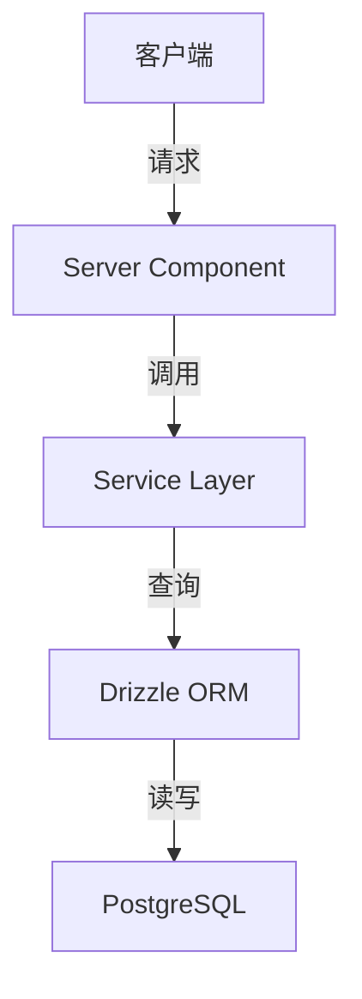

# 工作报告: Architect - [功能名称]

## 1. 任务摘要

> 简述本次架构设计任务的目标和范围。

**任务目标:** [描述此次架构设计要解决的问题或要达成的目标]

**涉及模块:** [列出涉及的功能模块或系统组件]

---

## 2. 完成工作

> 用列表形式描述具体完成的工作项。

- [ ] 设计了 [模块/功能] 的整体架构方案
- [ ] 定义了 [模块间/服务间] 的数据契约和接口规范
- [ ] 更新了数据库 ER 图 (如适用)
- [ ] 评估了 [技术选项A vs 技术选项B] 并做出了技术选型决策
- [ ] 绘制了 [系统交互流程图/组件关系图]

---

## 3. 关键决策 / 实现说明

> 解释在架构设计过程中做出的重要选择和背后的理由。

### 3.1 架构模式选择

**决策:** [描述选择的架构模式，如分层架构、模块化设计等]

**理由:**

- [原因1: 如符合项目的技术栈和规范]
- [原因2: 如满足性能/可维护性要求]
- [原因3: 如便于未来扩展]

### 3.2 数据流设计

**决策:** [描述数据在各层级/模块间的流动方式]

**关键点:**

- **数据获取:** [说明数据如何从数据源流向展示层]
- **数据变更:** [说明数据修改操作的处理流程]
- **状态管理:** [如适用，说明客户端状态管理策略]

### 3.3 模块/组件划分

**划分原则:** [说明如何划分模块或组件]

**模块清单:**

- **[模块A]:** [职责描述]
- **[模块B]:** [职责描述]
- **[模块C]:** [职责描述]

### 3.4 技术选型

**场景:** [描述需要选择技术方案的场景]

**候选方案:**

- **方案A:** [方案描述] - 优点: [...] / 缺点: [...]
- **方案B:** [方案描述] - 优点: [...] / 缺点: [...]

**最终选择:** [方案X]

**理由:** [详细说明选择理由]

---

## 4. 架构产出物

> 列出本次架构设计产出的文档、图表或配置文件。

### 4.1 架构图 / 流程图

[在此插入架构图、UML图或流程图的Markdown描述或Mermaid代码]



### 4.2 数据契约 (Data Contract)

**接口定义:**

```typescript
// Interface 1: [接口名称]
interface [InterfaceName] {
  // [字段说明]
}

// Interface 2: [接口名称]
interface [InterfaceName] {
  // [字段说明]
}
```

**Zod Schema 定义:**

```typescript
// Schema for [用途]
export const [schemaName] = z.object({
  // [字段定义]
});
```

### 4.3 更新的文档

- [ ] 更新了 `content/docs/technical-design/01-architecture.mdx` - [具体章节]
- [ ] 更新了 `content/docs/technical-design/05-database-design.mdx` - [ER图或表结构]
- [ ] 创建了架构决策记录 (ADR): `docs/adr/[decision-number]-[decision-title].md`

---

## 5. 文件变更列表

> 列出本次架构设计过程中创建、修改或删除的文件。

### 创建文件

- `[文件路径]` - [文件用途说明]

### 修改文件

- `[文件路径]` - [修改内容概述]

### 删除文件

- `[文件路径]` - [删除原因]

---

## 6. 后续建议

> 向下一个角色(通常是 Backend Developer)提供的建议和注意事项。

### 给 Backend Developer 的建议:

- [建议1: 如"优先实现XX核心服务函数"]
- [建议2: 如"注意XX字段的验证规则"]
- [建议3: 如"可以复用XX现有的工具函数"]

### 给 Frontend Developer 的建议:

- [建议1: 如"可以使用XX组件作为基础"]
- [建议2: 如"注意XX交互的状态管理"]

### 潜在风险提示:

- [风险1: 如"XX依赖的第三方API可能有速率限制"]
- [风险2: 如"XX数据量较大，需考虑分页"]

---

## 7. 验证与检查

> 架构设计是否符合项目规范的自查清单。

- [ ] 架构方案符合 Next.js 15 App Router 最佳实践
- [ ] 数据契约使用 TypeScript 和 Zod 定义，保证类型安全
- [ ] 模块划分遵循单一职责原则
- [ ] 设计方案与项目的非功能性需求一致 (性能、安全、可维护性)
- [ ] 所有架构决策都有明确的理由和文档记录

---

## 8. 备注

> 其他需要注意的事项或待解决的问题。

[在此添加任何补充说明或需要进一步讨论的技术细节]
