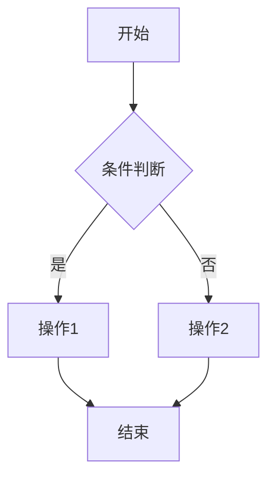

# 工作报告: Technical Writer - [功能名称]

## 1. 任务摘要

> 简述本次文档更新任务的目标和范围。

**任务目标:** [描述此次文档工作要达成的目标]

**涉及文档:** [列出需要创建或更新的文档类型]

---

## 2. 完成工作

> 用列表形式描述具体完成的工作项。

- [ ] 更新了功能需求文档: `[文档路径]`
- [ ] 更新了技术设计文档: `[文档路径]`
- [ ] 更新了 API 文档: `[文档路径]`
- [ ] 更新了附录文档 (UI文案/业务流程): `[文档路径]`
- [ ] 更新了 README.md
- [ ] 更新了 CONTRIBUTING.md
- [ ] 创建了架构决策记录 (ADR): `[文档路径]`

---

## 3. 关键决策 / 实现说明

> 解释在文档编写过程中做出的重要选择和内容组织方式。

### 3.1 功能需求文档更新

**文档路径:** `content/docs/functional-requirements/[module].mdx`

**更新内容:**

- **新增章节:** [章节标题] - [内容概述]
- **修改章节:** [章节标题] - [修改说明]
- **删除章节:** [章节标题] - [删除原因]

**关键需求点:**

#### 功能需求 FR-[编号]: [需求标题]

**描述:**
[详细描述此功能的业务目的和用户价值]

**验收标准 (Acceptance Criteria):**

- [ ] [标准1: 明确的、可验证的条件]
- [ ] [标准2: 明确的、可验证的条件]
- [ ] [标准3: 明确的、可验证的条件]

**前置条件:**

- [条件1: 如"用户已登录"]
- [条件2: 如"用户已绑定支付方式"]

**业务规则:**

- [规则1: 如"旅客姓名必须与证件一致"]
- [规则2: 如"儿童票价为成人票价的50%"]

---

### 3.2 技术设计文档更新

**文档路径:** `content/docs/technical-design/[document].mdx`

**更新内容:**

#### 架构变更 (如适用)

- **变更描述:** [说明架构上的变化]
- **影响范围:** [列出受影响的模块或组件]
- **变更理由:** [解释为什么做出此变更]

#### 数据库设计更新 (如适用)

- **新增表:** `[tableName]` - [表用途]
- **修改表:** `[tableName]` - [修改内容]
- **ER图更新:** [说明实体关系图的变化]

#### 技术选型说明 (如适用)

- **选型场景:** [描述需要技术选型的场景]
- **候选方案:** [方案A vs 方案B]
- **最终选择:** [方案X] - 理由: [详细说明]

---

### 3.3 数据流文档更新

**文档路径:** `content/docs/technical-design/07-data-flow.mdx`

**新增/修改的 Server Actions 或数据获取方式:**

#### Server Action: `[actionName]`

**功能描述:** [说明此 Server Action 的用途]

**输入参数:**

| 参数名        | 类型     | 必填 | 说明       | 示例        |
| ------------- | -------- | ---- | ---------- | ----------- |
| `[paramName]` | `string` | 是   | [参数说明] | `"example"` |
| `[paramName]` | `number` | 否   | [参数说明] | `123`       |

**请求示例:**

```json
{
  "[fieldName]": "[value]",
  "[fieldName]": "[value]"
}
```

**响应格式:**

**成功响应 (200 OK):**

```json
{
  "success": true,
  "data": {
    "[fieldName]": "[value]"
  }
}
```

**错误响应 (400 Bad Request):**

```json
{
  "success": false,
  "error": "[错误信息]"
}
```

**错误码说明:**

- `400` - 请求参数错误
- `401` - 未授权
- `404` - 资源不存在
- `500` - 服务器内部错误

---

### 3.4 附录文档更新 (UI文案/业务流程)

**文档路径:** `content/docs/appendix/[document].mdx`

**更新内容:**

#### UI文案

- **页面标题:** "[标题文案]"
- **按钮文案:**
  - 主要操作: "[文案]"
  - 次要操作: "[文案]"
  - 取消操作: "[文案]"
- **提示信息:**
  - 成功提示: "[文案]"
  - 错误提示: "[文案]"
  - 警告提示: "[文案]"
- **确认对话框:**
  - 标题: "[文案]"
  - 内容: "[文案]"
  - 确认按钮: "[文案]"
  - 取消按钮: "[文案]"

#### 业务流程图 (如适用)



---

### 3.5 项目 README 更新

**文档路径:** `README.md`

**更新内容:**

- **新增章节:** [章节标题] - [内容概述]
- **修改章节:** [章节标题] - [修改说明]

**主要变更:**

- [变更1: 如"添加了新的环境变量说明"]
- [变更2: 如"更新了部署流程说明"]
- [变更3: 如"新增了故障排查指南"]

---

### 3.6 贡献指南更新 (如适用)

**文档路径:** `CONTRIBUTING.md`

**更新内容:**

- [变更1: 如"更新了代码提交规范示例"]
- [变更2: 如"添加了新的测试要求"]

---

### 3.7 架构决策记录 (ADR) (如适用)

**文档路径:** `docs/adr/[number]-[title].md`

**ADR 编号:** ADR-[编号]

**标题:** [决策标题]

**状态:** [Proposed / Accepted / Deprecated / Superseded]

**背景:**
[描述做出此决策的背景和问题]

**决策:**
[明确说明做出的决策]

**理由:**

- [理由1]
- [理由2]
- [理由3]

**后果:**

- **正面影响:** [列出好处]
- **负面影响:** [列出代价或权衡]

**备选方案:**

- [方案A] - 未采纳原因: [原因]
- [方案B] - 未采纳原因: [原因]

---

## 4. 文档一致性检查

> 确保文档间的交叉引用和信息一致性。

### 4.1 文档间引用

**检查项:**

- [ ] 功能需求文档中的业务规则与 UI 文案文档一致
- [ ] 技术设计文档中的 API 定义与 API 文档一致
- [ ] 数据库设计文档中的表结构与代码中的 Schema 一致
- [ ] README 中的环境变量说明与 `.env.example` 一致

### 4.2 版本同步

- [ ] 所有文档的"最后更新日期"已更新
- [ ] 文档中提到的版本号与当前项目版本一致
- [ ] 文档中的截图和示例代码与当前实现一致

---

## 5. 文件变更列表

> 列出本次文档工作中创建、修改或删除的文件。

### 创建文件

- `content/docs/[path]/[document].mdx` - [文档用途]
- `docs/adr/[number]-[title].md` - [ADR 文档]

### 修改文件

- `content/docs/functional-requirements/[module].mdx` - [修改概述]
- `content/docs/technical-design/[document].mdx` - [修改概述]
- `content/docs/appendix/[document].mdx` - [修改概述]
- `README.md` - [修改概述]
- `CONTRIBUTING.md` - [修改概述]

### 删除文件

- `[文件路径]` - [删除原因]

---

## 6. 文档质量检查

> 文档编写是否符合项目标准的自查清单。

- [ ] 所有文档使用简体中文编写
- [ ] 代码示例使用英文注释
- [ ] 文档标题层级结构清晰 (H1 -> H2 -> H3)
- [ ] 所有外部链接可访问
- [ ] 所有内部交叉引用路径正确
- [ ] Markdown 语法正确，无渲染错误
- [ ] 图表和流程图可正确显示 (如使用 Mermaid)
- [ ] 代码块指定了正确的语言标识 (typescript, json, bash 等)
- [ ] 文档中的术语使用一致 (参考项目术语表)
- [ ] 无拼写和语法错误

---

## 7. 后续建议

> 向项目团队提供的文档维护建议。

### 文档维护计划:

- [建议1: 如"建议每个 Sprint 结束时同步更新一次文档"]
- [建议2: 如"需要定期检查文档中的外部链接有效性"]
- [建议3: 如"建议为新加入的成员准备快速入门文档"]

### 待完善的文档:

- [文档1: 如"性能测试文档尚未创建，建议在性能优化迭代时补充"]
- [文档2: 如"部署运维手册需要更详细的故障排查流程"]

### 文档改进建议:

- [建议1: 如"可以考虑使用交互式文档工具提升可读性"]
- [建议2: 如"添加更多实际业务场景的示例"]

---

## 8. 审阅清单

> 文档提交前的最终审阅要点。

**内容审阅:**

- [ ] 文档内容准确，与实际实现一致
- [ ] 文档完整，涵盖了所有必要的信息
- [ ] 文档清晰，易于理解和遵循
- [ ] 文档结构合理，信息组织有序

**技术审阅:**

- [ ] 代码示例可运行，无错误
- [ ] API 文档与实际接口一致
- [ ] 技术术语使用正确

**格式审阅:**

- [ ] Markdown 语法正确
- [ ] 排版美观，格式统一
- [ ] 图表和代码块正确渲染

---

## 9. 文档访问路径

> 提供更新后的文档访问方式。

**本地文档服务:**

- 启动命令: `pnpm dev`
- 访问地址: `http://localhost:3000/docs`

**在线文档 (如已部署):**

- URL: `[部署的文档站点 URL]`

**关键文档快速链接:**

- [功能需求] `content/docs/functional-requirements/[module].mdx`
- [技术设计] `content/docs/technical-design/[document].mdx`
- [数据流文档] `content/docs/technical-design/07-data-flow.mdx`

---

## 10. 备注

> 其他需要注意的事项或文档相关的说明。

[在此添加任何补充说明、文档编写过程中遇到的问题或需要进一步讨论的内容]
