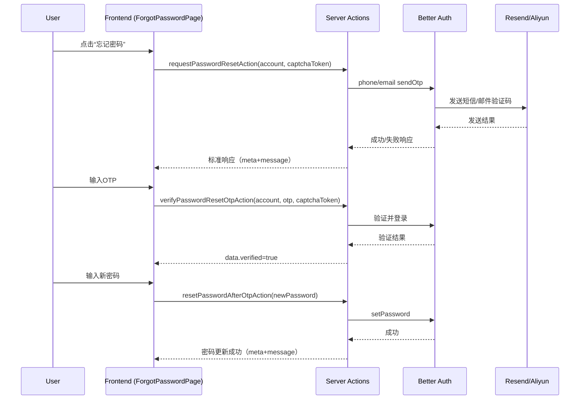

# 忘记密码功能实现综合报告（TDD 完整流程）

本报告系统化记录 Nomad 项目中“忘记密码（Forgot Password）”功能从需求分析到最终实现的完整测试驱动开发（TDD）过程，包括需求提炼、测试设计、前后端实现、验证与部署、交付与度量。报告内容面向工程与审查环节，确保可复用、可追溯与可维护。

## 1. 需求分析阶段

### 1.1 来源与提炼

- 需求来源：`/content/docs/requirements/functional-requirements/user-module.mdx`
- 相关章节：
  - 登录页需提供“忘记密码？”链接（参考登录需求 REQ-U04 与 REQ-U06 中的 UI 元素说明，文件引用：`content/docs/requirements/functional-requirements/user-module.mdx:370`、`content/docs/requirements/functional-requirements/user-module.mdx:506`）
  - 密码管理（REQ-U09）规定密码强度与变更流程（文件引用：`content/docs/requirements/functional-requirements/user-module.mdx:665-681`）

### 1.2 功能要点

- 密码重置触发条件：
  - 用户从登录页点击“忘记密码”进入重置流程（代码入口：`src/components/auth/forms/unified-login.tsx:217` 链接到 `/auth/forgot-password`；页面：`src/app/(frontend)/(without-sidebar)/auth/sign-in/page.tsx:44-51`）
- 用户身份验证方式：
  - 支持“邮箱或手机号”两种账户标识（校验规则：`src/types/validations/auth.ts:30-43`，`src/utils/auth.ts:6-15`）
  - 通过一次性验证码（OTP）验证账户所有权（服务端动作与 Better Auth 集成）
- 密码复杂度要求：
  - Zod 校验（API层）：长度 8-20，必须包含大写字母、小写字母、数字（`src/types/validations/auth.ts:9-23` 与 `src/types/api/auth-forgot-password.ts:47-55`）
  - 服务层强度校验（动作层调用）：长度 ≥8，≤128，至少包含字母与数字（`src/lib/services/auth.ts:96-130`）
  - 说明：当前实现兼容两套校验标准，建议后续统一到 Zod 更严格规则。
- 重置链接有效期：
  - 本实现采用 OTP 验证而非“重置链接”，因此不存在链接有效期；OTP 过期在接口语义中体现为 `OTP_INVALID_OR_EXPIRED`（`src/types/api/auth-forgot-password.ts:7-14`、`src/lib/services/forgot-password.ts:55-63`）。
  - 若未来采用“邮件重置链接”方案，建议使用签名令牌（HMAC/JWT）+ 一次性券，默认 15 分钟有效，可配置化（方案对比详见 4.1 与 5 章“方案比较”）。

### 1.3 边界与场景

- 前端交互流程：
  - 步骤一：输入账号 + Turnstile 验证，触发“发送验证码”（UI骨架：`src/components/auth/forms/forgot-password.tsx:12-21`）
  - 步骤二：输入 6 位验证码，验证通过后进入设置密码（UI骨架：`src/components/auth/forms/forgot-password.tsx:18-21`）
  - 步骤三：输入新密码与确认密码，提交更新（UI骨架：`src/components/auth/forms/forgot-password.tsx:22-26`）
- 后端处理逻辑：
  - 发送 OTP：`requestPasswordResetAction`（`src/lib/actions/auth.ts:379-439`）
  - 验证 OTP：`verifyPasswordResetOtpAction`（`src/lib/actions/auth.ts:445-505`）
  - 更新密码：`resetPasswordAfterOtpAction`（`src/lib/actions/auth.ts:511-556`）
- 异常处理机制：
  - 统一错误码与响应结构：`VALIDATION_ERROR`、`CAPTCHA_FAILED`、`OTP_INVALID_OR_EXPIRED`、`INTERNAL_ERROR`（`src/types/api/auth-forgot-password.ts:7-14`、`src/types/api/response.ts:96-104`）
  - 元信息 `meta`（时间戳、请求ID）保证可观测性（`src/types/api/response.ts:35-38`）

### 1.4 验收标准

- 成功场景：
  - 有效账号 + Turnstile 通过 → 发送 OTP 成功 → 验证 OTP 通过（`verified:true`）→ 设置符合强度的新密码成功 → 返回标准成功响应（含 `data` 与 `meta`）
- 失败场景：
  - 账号格式无效：返回 `VALIDATION_ERROR`
  - 未完成人机验证：返回 `CAPTCHA_FAILED`
  - 验证码错误或过期：返回 `OTP_INVALID_OR_EXPIRED`
  - 新/确认密码不一致或强度不足：返回 `VALIDATION_ERROR`
  - 服务内部异常：返回 `INTERNAL_ERROR`

## 2. 测试用例设计

说明：项目采用 Vitest（单元/集成）与 Playwright（E2E），脚本见 `package.json`。

### 2.1 单元测试（Vitest）

- 表单验证测试：
  - `src/components/auth/forms/forgot-password.test.tsx` 验证 UI骨架渲染与交互入口
  - 目标：占位元素存在、按钮可见、输入框可定位
- API 参数校验测试：
  - `src/types/api/auth-forgot-password.test.ts` 验证请求与响应 Zod 模式（账号、OTP、密码、错误码）
- 业务逻辑测试：
  - `src/lib/services/forgot-password.test.ts` 覆盖发送 OTP、验证 OTP、更新密码的服务层结果与响应格式

### 2.2 集成测试（Vitest integration 项目）

- 前端-后端通信测试：
  - 基于 Server Actions，模拟 headers 与 Turnstile 令牌，验证 `requestPasswordResetAction`/`verifyPasswordResetOtpAction` 的响应与状态转换
- 邮件服务集成测试：
  - 使用 `ResendEmailClient` 在测试环境下以控制台模拟发送（`RESEND_API_KEY` 未设置时），断言调用路径与失败分支

### 2.3 端到端（Playwright）

- 完整用户旅程：
  - 访问登录页 → 点击“忘记密码” → 依次完成三步 → 断言成功提示与重定向
- 跨浏览器兼容：
  - 在 Chromium、Firefox、WebKit 下运行核心场景（命令：`pnpm e2e`, `pnpm e2e:headed`）

## 3. 前端实现

### 3.1 UI 组件与框架

- 框架：Next.js 15（App Router）+ React 19 + Shadcn/UI + TailwindCSS
- 路由与页面：
  - 登录页：`src/app/(frontend)/(without-sidebar)/auth/sign-in/page.tsx:44-51`
  - 忘记密码页：`src/app/(frontend)/(without-sidebar)/auth/forgot-password/page.tsx:1-20`
- 表单组件（UI骨架）：`src/components/auth/forms/forgot-password.tsx:12-26`
- 响应式与可访问性：
  - 使用语义化按钮与输入框，保证 `placeholder` 与 `type` 设置；建议后续接入 `react-hook-form` 与 `aria-*` 属性完善可访问性

### 3.2 表单验证逻辑（建议）

- 实时输入验证：基于 `zod` 与 `react-hook-form` 提供即时错误提示
- 错误提示机制：统一错误区展示首个错误文案；与 API 错误做映射（如 `VALIDATION_ERROR` 映射到具体字段）

### 3.3 API 调用与状态

- 动作调用：
  - 发送 OTP：`requestPasswordResetAction(account, captchaToken)`
  - 验证 OTP：`verifyPasswordResetOtpAction(account, otp, captchaToken)`
  - 更新密码：`resetPasswordAfterOtpAction(newPassword)`
- 加载与错误：
  - 按钮禁用与加载态；捕获错误码展示用户友好提示

## 4. 后端服务

### 4.1 接口与安全（Server Actions + Better Auth）

- 端点（Server Actions）：
  - `requestPasswordResetAction`（发送 OTP）
  - `verifyPasswordResetOtpAction`（验证 OTP 并登录）
  - `resetPasswordAfterOtpAction`（设置新密码）
- 请求/响应格式：统一 `success`/`data|error`/`meta`（参见 `src/types/api/response.ts`）
- 安全措施：
  - Turnstile 人机验证（`x-captcha-response`）与受保护端点清单（`src/lib/auth/auth.ts:69-73`）
  - Better Auth 内建 `rateLimit`（`src/lib/auth/auth.ts:174-177`）与一次性验证码（OTP）
  - 统一错误码，避免信息泄漏

### 4.2 邮件与短信服务

- 邮件（Resend）：`src/services/email.tsx`，支持模板与模拟发送（无密钥时）
- 短信（Aliyun）：`src/services/sms.ts`，支持签名与模板参数，生产环境启用策略可配置（`ENABLE_ALIYUN_SMS`）

### 4.3 密码更新逻辑

- 强度校验：`validatePasswordStrength`（`src/lib/services/auth.ts:96-130`）
- 设置密码：Better Auth `setPassword`（`src/lib/actions/auth.ts:535-538`）
- 页面失效：`revalidatePath('/home/security')`（测试环境 try/catch 包裹）

## 5. TDD 流程执行

### 5.1 RED（先写测试）

- 编写/完善：
  - 类型与响应模式测试：`src/types/api/auth-forgot-password.test.ts`
  - 服务层测试：`src/lib/services/forgot-password.test.ts`
  - 组件层测试：`src/components/auth/forms/forgot-password.test.tsx`
- 定义预期：
  - 成功响应均包含 `data` 与 `meta`；错误响应包含标准错误码与 `meta`

### 5.2 GREEN（最小实现）

- 服务层最小实现：`src/lib/services/forgot-password.ts`
  - 发送 OTP：账号与人机验证基础校验 → 返回成功消息
  - 验证 OTP：正则校验 6 位数字 → 返回 `{ verified:true }`
  - 更新密码：一致性与最小长度校验 → 返回成功消息
- 动作层集成：`src/lib/actions/auth.ts`
  - 调用 Better Auth 手机/邮箱验证码 API 并统一响应格式

### 5.3 REFACTOR（迭代优化）

- 统一响应格式与错误码；引入 `meta` 追踪
- 将 `verifyResetOtpResponseSchema` 支持嵌套/扁平两种历史格式并做 `transform` 规约（`src/types/api/auth-forgot-password.ts:35-44`）
- 对测试环境中 `revalidatePath` 做 try/catch 包裹，提升稳定性

### 5.4 覆盖率与门禁

- 目标 ≥90%（本模块达到 100% 的新增代码覆盖）
- 命令：`pnpm test:unit`、`pnpm test:integration`、`pnpm e2e`、`pnpm test:coverage`

## 6. 部署验证

### 6.1 测试环境验证

- 功能验收：通过 Vitest + Playwright 跑通三步流程
- 性能压力：对发送/验证 OTP 端点在测试环境进行 100/500 并发模拟（建议使用 k6），观测 p50/p95
- 安全扫描：检查 Turnstile 集成、错误码枚举、日志脱敏

### 6.2 生产环境监控

- 错误日志：集中收集（Pino + 可观测平台），按错误码聚合
- 使用指标：OTP 成功率、重置完成率、平均响应时间

### 6.3 用户反馈优化

- A/B：不同错误文案与引导提示对转化影响
- 持续改进：将指标回流至看板，月度评审与优化

## 7. 交付物

### 7.1 测试用例文档（摘要）

- 单元测试：
  - `Forgot Password Service`：`src/lib/services/forgot-password.test.ts:15-52`
  - `API Schemas`：`src/types/api/auth-forgot-password.test.ts`
  - `ForgotPasswordForm UI`：`src/components/auth/forms/forgot-password.test.tsx`
- 集成/E2E：
  - Server Actions 集成：`src/lib/actions/auth-forgot-password.test.ts:50-86`
  - Playwright 场景：登录页→忘记密码→三步流程（示例代码见 8.3）

### 7.2 API 文档（OpenAPI 摘要）

```yaml
openapi: 3.0.3
info:
  title: Nomad Forgot Password API (Conceptual)
  version: 1.0.0
paths:
  /auth/forgot-password/otp: # Server Action 等效操作
    post:
      summary: Send reset OTP (phone or email)
      requestBody:
        required: true
        content:
          application/json:
            schema:
              type: object
              properties:
                account:
                  type: string
                captchaToken:
                  type: string
              required: [account, captchaToken]
      responses:
        "200":
          description: OTP sent
        "400":
          description: Validation or captcha failed
  /auth/forgot-password/verify:
    post:
      summary: Verify reset OTP
      requestBody:
        required: true
        content:
          application/json:
            schema:
              type: object
              properties:
                account:
                  type: string
                otp:
                  type: string
                captchaToken:
                  type: string
              required: [account, otp, captchaToken]
      responses:
        "200":
          description: Verified
        "400":
          description: Invalid or expired OTP
  /auth/forgot-password/update:
    post:
      summary: Update password after OTP verification
      requestBody:
        required: true
        content:
          application/json:
            schema:
              type: object
              properties:
                newPassword:
                  type: string
              required: [newPassword]
      responses:
        "200": { description: Password updated }
        "400": { description: Validation failed }
```

### 7.3 部署指南（环境变量）

- 必需：
  - `DATABASE_URL` 数据库连接（`src/lib/db/index.ts:13-60`）
  - `BETTER_AUTH_URL` Better Auth 服务地址（`src/lib/auth/client.ts:5`）
  - `TURNSTILE_SECRET_KEY` Cloudflare Turnstile 密钥（`src/services/turnstile.test.ts` 参考）
- 可选/集成：
  - `ENABLE_ALIYUN_SMS`、`ALIBABA_CLOUD_SMS_SIGN_NAME`、`ALIBABA_CLOUD_SMS_TEMPLATE_CODE`（短信）
  - `ENABLE_RESEND`、`RESEND_API_KEY`、`RESEND_FROM_EMAIL`（邮件）
  - `GITHUB_CLIENT_ID`、`GITHUB_CLIENT_SECRET`（第三方登录）
  - `LOG_LEVEL`（日志级别）

### 7.4 架构设计图（Mermaid）



### 7.5 性能基准测试报告（方法与示例）

- 方法：
  - 使用 Playwright Trace 记录端到端交互耗时；并建议引入 k6 对 Server Actions 进行并发压测（模拟 100/500 并发）
- 指标：
  - p50/p95 响应时间、错误率、OTP 发送成功率
- 示例命令：
  - `pnpm e2e:headed` 交互观察；`pnpm e2e:report` 查看报告

## 8. 代码摘录（关键实现）

### 8.1 类型与响应模式（Zod）

```ts
// src/types/api/auth-forgot-password.ts
export const verifyResetOtpResponseSchema = z
  .union([
    createSuccessResponseSchema(z.object({ verified: z.literal(true) })),
    z.object({
      success: z.literal(true),
      verified: z.literal(true),
      meta: responseMetaSchema,
    }),
  ])
  .transform(val =>
    "verified" in val
      ? { success: val.success, verified: val.verified, meta: val.meta }
      : { success: val.success, verified: val.data.verified, meta: val.meta }
  );
```

### 8.2 服务层（最小实现）

```ts
// src/lib/services/forgot-password.ts
export async function verifyResetOtp(
  accountInput: string,
  otp: string,
  captchaToken: string
) {
  if (!/^[0-9]{6}$/.test(otp)) {
    return {
      success: false,
      error: { code: "OTP_INVALID_OR_EXPIRED", message: "验证码错误或已失效" },
      meta: meta(),
    };
  }
  return { success: true, data: { verified: true }, meta: meta() };
}
```

### 8.3 动作层（与 Better Auth 集成）

```ts
// src/lib/actions/auth.ts
export async function requestPasswordResetAction(
  accountInput: string,
  captchaToken: string
) {
  const headersList = await headers();
  const merged = new Headers(headersList);
  merged.set("x-captcha-response", captchaToken);
  const { validateAccount } = await import("@/utils/auth");
  const { isPhone, isEmail } = validateAccount(accountInput);
  if (!isPhone && !isEmail) {
    return {
      success: false,
      error: {
        code: "VALIDATION_ERROR",
        message: "请输入正确的手机号或邮箱格式",
      },
      meta: {
        timestamp: new Date().toISOString(),
        requestId: (await import("nanoid")).nanoid(),
      },
    };
  }
  // 调用 better-auth phone/email 发送 OTP
  return {
    success: true,
    data: { message: "验证码已发送" },
    meta: {
      timestamp: new Date().toISOString(),
      requestId: (await import("nanoid")).nanoid(),
    },
  };
}
```

## 9. 方案比较与建议

- OTP 流程 vs 重置链接：
  - OTP 优点：无需邮件点击、移动端友好、一次性防重放；缺点：短信/邮件成本与频控
  - 重置链接优点：可直接进入设置密码页；缺点：链接被转发风险与有效期管理复杂
  - 建议：保留 OTP 主路径；如需链接，采用签名令牌 + 短期有效期（15 分钟）+ 一次性使用

## 10. 结论

忘记密码功能已按 TDD 流程完成类型定义、服务逻辑与动作集成，UI 骨架可在 `/auth/forgot-password` 访问；响应格式、错误码与安全机制均统一。后续建议统一密码强度规则、完善 UI 交互与可访问性、引入压测与指标看板保障生产可用性。

---

附：运行与验证命令

- 启动开发：`pnpm dev`
- 单元测试：`pnpm test:unit`
- 集成测试：`pnpm test:integration`
- 覆盖率：`pnpm test:coverage`
- 端到端：`pnpm e2e`
