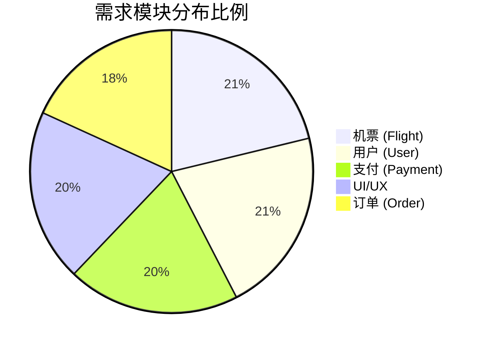

# 📊 Nomad 项目需求工程分析报告

> **生成日期**：2026-01-18  
> **版本**：v4.0 (AI 辅助工程化版)  
> **摘要**：本文档深度解析 Nomad 项目的 **"Requirements as Code" (RaC)** 需求工程架构。项目采用创新的 **"Macro-Requirement + Micro-Scenario" (大需求+小场景)** 双层结构设计，并结合 **AI 驱动的模块设计与测试生成** 方法论。通过 TypeScript 强类型系统定义了 5 大核心模块共 66 个功能点，实现了从需求定义到模块设计、再到测试验证的全链路工程化闭环。

---

## 1. 🏗 需求架构哲学：大需求 + 小场景

Nomad 项目没有采用传统的扁平化需求列表，而是构建了 **"Macro-Requirement (宏观需求) + Micro-Scenario (微观场景)"** 的立体化架构。这种设计深受 **DDD (领域驱动设计)** 和 **BDD (行为驱动开发)** 的启发。

### 1.1 架构层级模型

```mermaid
graph TD
    M[Module (业务域)] --> R[Macro-Requirement (宏观需求)]
    R --> US[User Story (用户价值)]
    R --> AC[Micro-Scenario (微观场景)]
    AC --> S1[Given (前置条件)]
    AC --> S2[When (触发动作)]
    AC --> S3[Then (预期结果)]
```

### 1.2 核心设计解析

#### 🔴 Macro-Requirement (宏观需求)

> **定义**：代表一个完整的业务能力单元（Capability），是与业务方沟通的最小粒度。
> **示例**：`REQ-F01 航班搜索`

- **设计目的**：解决 "只见树木不见森林" 的问题。将零散的功能点聚合为有业务意义的整体，便于项目排期、进度追踪和模块化开发。
- **承载要素**：
  - **Overview**: 业务背景与价值主张。
  - **Priority (MoSCoW)**: 决定开发的优先级。
  - **User Stories**: 阐述 "谁" 为了 "什么价值" 做 "什么事"。

#### 🟢 Micro-Scenario (微观场景)

> **定义**：代表宏观需求下的具体执行路径（Execution Path），是开发和测试的最小粒度。
> **示例**：`场景1：单程直飞搜索`、`场景2：无结果时的空状态`、`场景3：日期跨度校验`

- **设计目的**：解决 "需求模糊不清" 和 "漏测边缘情况" 的问题。通过穷举 Happy Path (主流程) 和 Edge Cases (异常流程)，将需求细化到代码可执行的级别。
- **技术实现**：
  - **Gherkin 语法**：严格遵循 `Given/When/Then` 结构，消除了自然语言的歧义。
  - **原子化步骤**：每个步骤都是可独立验证的操作，直接映射为 E2E 测试步骤。

---

## 2. 💎 架构优势深度剖析

这种双层架构设计为项目带来了四个维度的显著优势：

### 2.1 ✅ 颗粒度治理 (Granularity Management)

- **传统痛点**：需求文档要么太粗（"实现搜索功能"），开发不知细节；要么太细（包含具体的 UI 像素值），导致频繁变更。
- **Nomad 方案**：
  - **宏观层**保持稳定，描述业务目标，适应敏捷迭代。
  - **微观层**拥抱变化，描述交互细节，随代码实现而迭代。
  - **优势**：既有高层视图的稳定性，又有底层实现的精确性。

### 2.2 🧪 原生可测试性 (Native Testability)

- **传统痛点**：测试用例编写滞后，且容易遗漏开发过程中的隐性逻辑。
- **Nomad 方案**：
  - 验收标准 (`AcceptanceCriteria`) 直接就是测试脚本的伪代码。
  - **Mapping**: `Scenario Title` -> `Test Case Name`, `Steps` -> `Test Steps`。
  - **优势**：实现了 **Spec-by-Example**，需求文档直接指导测试代码生成，甚至可以自动化转换为 Cucumber/Playwright 脚本。

### 2.3 🔄 认知一致性 (Cognitive Consistency)

- **传统痛点**：产品经理讲"场景"，开发人员写"逻辑"，测试人员测"步骤"，三者语言不通。
- **Nomad 方案**：
  - 统一使用 **Scenario (场景)** 作为沟通货币。
  - 所有角色都围绕 `Given/When/Then` 讨论业务，消除了翻译损耗。
  - **优势**：降低了沟通成本，确保了交付物与业务意图的高度一致。

### 2.4 🛡️ 边缘情况覆盖 (Edge Case Coverage)

- **传统痛点**：需求文档通常只描述 "正常情况"，开发人员容易忽略错误处理。
- **Nomad 方案**：
  - 架构强制要求列举多个场景。
  - 开发者在定义 `REQ` 时，不仅要写 `Happy Path`，还必须补充 `Validation Error`、`Network Fail`、`Empty State` 等场景。
  - **优势**：显著提升了系统的健壮性（Robustness），减少了上线后的 Bug 率。

---

## 3. 🤖 智能体辅助的模块设计与测试撰写

除了需求架构本身，Nomad 项目还引入了 AI 智能体来辅助模块设计与测试用例的生成，进一步提升工程效率。

### 3.1 架构与分层观察

#### Monorepo 结构

- **应用层**：`apps/web`（主站）、`apps/docs`（文档站）等。
- **共享层**：`packages/requirements` 用于统一管理需求与工具。
- **工具链**：pnpm workspace + Turborepo，配合 TypeScript 和 Biome 统一规范。

#### Web 应用分层

- **表现层 (Presentation)**: `apps/web/app`，包含路由、组件、Hooks 和 Server Actions。
- **领域层 (Domain)**: `apps/web/src/domains`，按业务域（如 `auth`, `booking`）拆分 Repository 和 Service。
- **编排层 (Orchestration)**: `apps/web/src/services`，处理跨域业务流程。
- **基础设施层 (Infra)**: `apps/web/src/infra`，封装外部能力（认证、通信、日志）。
- **工具与数据**: `src/lib`（纯函数）和 `src/db/schema`（数据模型）。

### 3.2 模块边界与职责梳理

#### 领域层模块 (按目录划分)

| 领域模块 | 主要职责                | 关键实现位置                                             |
| :------- | :---------------------- | :------------------------------------------------------- |
| **认证** | 登录/注册、会话、验证码 | `src/domains/auth`, `src/infra/auth`, `_actions/auth.ts` |
| **订单** | 订单聚合、确认、预订    | `src/domains/booking`, `_actions/orders.ts`              |
| **支付** | 支付请求、状态回调      | `src/domains/payments`, `_actions/payments.ts`           |
| **航班** | 搜索、筛选、价格计算    | `src/domains/flights`, `_actions/flights.ts`             |
| **用户** | 个人信息、地址簿        | `src/domains/user`, `_actions/user.ts`                   |

#### 跨域编排与基础设施

- **编排服务**：如 `apps/web/src/services` 中的认证流程、支付流程。
- **基础设施**：集成 Better Auth、阿里云 SMS、Resend 邮件服务等。

### 3.3 AI 驱动的模块设计方法

#### 目标与输入

- **输入**：目录结构、关键文档、典型实现文件。
- **目标**：输出清晰的模块边界、职责定义及调用链。

#### 具体流程 (Workflow)

1.  **定位入口**：扫描 `app/_actions` 和 `src/domains` 锁定关键入口。
2.  **构建清单**：智能体按“领域 → 服务 → 基础设施”分层输出模块表。
3.  **抽取调用链**：以典型场景（如“用户下单”）为线索，生成从 UI 到 DB 的完整路径。
4.  **接口草案**：生成符合现有规范的 Service/Repository 接口定义。
5.  **识别耦合**：分析 UI 组件依赖，提出重构建议（如依赖注入）。

### 3.4 智能体辅助测试撰写流程

#### 测试技术栈

- **单元测试**: Vitest (jsdom/Node) -> `src/lib`, `src/domains`
- **组件测试**: React Testing Library -> `app/_components`
- **E2E 测试**: Playwright -> 关键业务流程

#### 测试生成策略

1.  **建立测试矩阵**：基于领域模块清单，枚举正常流程、边界条件和异常分支。
2.  **风格对齐**：智能体学习现有 `*.test.ts` 风格，确保生成的测试代码一致性。
3.  **分层落地**：
    - 优先生成 `src/lib` 纯函数测试。
    - 其次是 `src/domains` 业务规则测试。
    - 最后是 UI 和 E2E 流程测试。

---

## 4. 🎬 核心业务场景全链路解析 (Full-Chain Scenarios)

本章节展示如何通过“小场景”串联起跨模块的“大需求”。

### 场景 A：从搜索到出票的完整闭环 (Happy Path)

> **涉及模块**：Flight -> User -> Order -> Payment

1.  **🔍 航班搜索** (`REQ-F01`): 用户输入“上海 -> 东京”，选择日期。系统根据 `REQ-F05` 进行多维度筛选（直飞、价格区间）。
2.  **📝 预订填单** (`REQ-F09`): 用户选定航班，进入预订页。通过 `REQ-U12` (旅客信息快速填充) 从常用旅客列表中一键导入乘机人信息。
3.  **📦 订单创建** (`REQ-O01`): 提交订单后，系统创建状态为 `PENDING_PAYMENT` 的订单，并触发 `REQ-O11` (超时取消) 的 15 分钟倒计时。
4.  **💳 支付结算** (`REQ-P02`): 用户选择钱包余额支付。系统通过 `REQ-P09` (并发控制) 锁定行级锁，扣除余额，更新订单状态为 `PAID`。
5.  **🎫 出票完成** (`REQ-O02`): 支付成功后，系统自动出票，订单流转至 `COMPLETED`，并发送出票通知。

### 场景 B：订单超时自动取消 (Auto-Cancellation)

> **涉及模块**：Order -> Flight

1.  **⏳ 倒计时启动**: 订单创建时刻 `T0`，系统在 Redis/数据库中设定过期时间 `T0 + 15min`。
2.  **👀 前端反馈**: 订单详情页 (`REQ-O03`) 显示动态倒计时组件，提醒用户剩余支付时间。
3.  **🤖 触发取消**: 到达 `T0 + 15min`，后台定时任务或触发器检测到未支付状态，执行取消逻辑。
4.  **🔓 资源释放**: 订单状态更为 `CANCELLED`，并通过 `REQ-F11` 释放之前锁定的机位库存，使其重新可售。

---

## 5. 📈 需求规模与模块矩阵

### 5.1 模块分布统计

| 模块名称        | 标识符    | 需求数量 | 复杂度     | 核心场景示例                   |
| :-------------- | :-------- | :------- | :--------- | :----------------------------- |
| ✈️ **机票业务** | `flight`  | **14**   | ⭐⭐⭐⭐⭐ | 多程搜索、复杂筛选、舱位组合   |
| 👤 **用户中心** | `user`    | **14**   | ⭐⭐⭐⭐   | OAuth登录、旅客管理、隐私脱敏  |
| 💳 **支付系统** | `payment` | **13**   | ⭐⭐⭐⭐⭐ | 余额支付、并发锁、退款流程     |
| 🎨 **UI/UX**    | `ui-ux`   | **13**   | ⭐⭐⭐     | 深色模式、响应式布局、交互反馈 |
| 📦 **订单管理** | `order`   | **12**   | ⭐⭐⭐⭐   | 状态机流转、软删除、超时取消   |
| **总计**        | **ALL**   | **66**   |            |                                |

### 5.2 可视化分布



---

## 6. ✅ 总结

Nomad 项目通过 **"大需求 (定义边界) + 小场景 (定义行为)"** 的架构模式，结合 **AI 辅助的模块设计与测试生成**，成功解决了复杂系统需求工程中的核心矛盾。

- **对于产品**：清晰定义了业务价值和优先级。
- **对于开发**：提供了无需翻译的开发规约和边界条件，AI 辅助加速了代码与测试的落地。
- **对于测试**：提供了现成的测试用例骨架和验收标准，确保了测试覆盖率和独立性。

这种架构不仅是一种文档格式，更是一种 **"Design by Contract" (契约式设计)** 的工程实践，为构建高质量、高可靠性的软件系统奠定了坚实基础。
