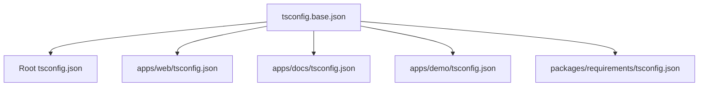
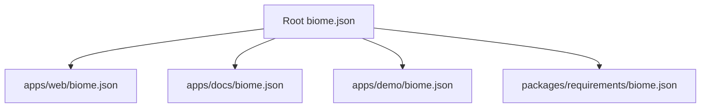

## Configuration Principles

<Callout type="info">
**Core Principle**: Root configuration as the source of truth, with minimal app-specific overrides.
</Callout>

All shared configuration lives at the root, and applications extend it only when necessary. This ensures consistency across the monorepo.

---

## TypeScript Configuration

### Configuration Hierarchy



### Base Configuration

`tsconfig.base.json` contains all shared compiler options:

```json
{
  "compilerOptions": {
    "target": "ES2017",
    "lib": ["dom", "dom.iterable", "esnext"],
    "allowJs": true,
    "skipLibCheck": true,
    "strict": true,
    "noEmit": true,
    "esModuleInterop": true,
    "module": "esnext",
    "moduleResolution": "bundler",
    "resolveJsonModule": true,
    "isolatedModules": true,
    "jsx": "preserve",
    "incremental": true
  },
  "exclude": ["node_modules"]
}
```

### Application Configuration

Each app extends the base and adds only **app-specific** settings:

#### ✅ Correct Example

```json title="apps/web/tsconfig.json"
{
  "extends": "../../tsconfig.base.json",
  "compilerOptions": {
    "plugins": [{ "name": "next" }],
    "paths": {
      "@/*": ["./src/*"],
      "@/components/*": ["./app/_components/*"]
    }
  },
  "include": ["next-env.d.ts", "**/*.ts", "**/*.tsx"]
}
```

**Why it's correct**: Only includes Next.js plugin and app-specific path aliases.

#### ❌ Incorrect Example

```json title="apps/web/tsconfig.json"
{
  "extends": "../../tsconfig.base.json",
  "compilerOptions": {
    "target": "ES2017",           // ❌ Already in base
    "strict": true,               // ❌ Already in base
    "skipLibCheck": true,         // ❌ Already in base
    "plugins": [{ "name": "next" }],
    "paths": {
      "@/*": ["./src/*"]
    }
  }
}
```

**Why it's incorrect**: Duplicates settings from base configuration.

### Path Aliases Reference

| Application | Path Alias | Resolves To |
|-------------|-----------|-------------|
| **web** | `@/*` | `./src/*` |
| | `@/actions/*` | `./app/_actions/*` |
| | `@/components/*` | `./app/_components/*` |
| | `@/hooks/*` | `./app/_hooks/*` |
| **docs** | `@/*` | `./*` |
| | `@/components/*` | `./components/*` |
| | `@/lib/*` | `./lib/*` |
| **demo** | `@/*` | `./*` |
| | `@/app/*` | `./app/*` |
| | `@/remotion/*` | `./remotion/*` |

---

## Biome Configuration

### Configuration Hierarchy



### Root Configuration

`biome.json` contains all linter rules and formatter settings:

```json
{
  "$schema": "https://biomejs.dev/schemas/2.3.10/schema.json",
  "root": true,
  "formatter": {
    "enabled": true,
    "indentStyle": "space",
    "indentWidth": 2
  },
  "linter": {
    "enabled": true,
    "rules": {
      "recommended": false,
      "suspicious": {
        "noConsole": "warn",
        "noExplicitAny": "warn"
      },
      "style": {
        "useConst": "error",
        "useTemplate": "error"
      }
    }
  }
}
```

### Application Configuration

Apps extend the root and add only **file-specific** settings:

#### ✅ Correct Example

```json title="apps/docs/biome.json"
{
  "$schema": "https://biomejs.dev/schemas/2.3.10/schema.json",
  "extends": "//",
  "vcs": {
    "enabled": true,
    "clientKind": "git",
    "useIgnoreFile": true
  },
  "files": {
    "ignoreUnknown": true,
    "includes": ["**", "!node_modules", "!.next", "!.source"]
  }
}
```

**Why it's correct**: Only specifies VCS and file includes/excludes.

#### ❌ Incorrect Example

```json title="apps/docs/biome.json"
{
  "$schema": "https://biomejs.dev/schemas/2.3.10/schema.json",
  "extends": "//",
  "formatter": {
    "enabled": true,        // ❌ Already in root
    "indentWidth": 2        // ❌ Already in root
  },
  "linter": {
    "enabled": true,        // ❌ Already in root
    "rules": {
      "recommended": true   // ❌ Conflicts with root
    }
  }
}
```

**Why it's incorrect**: Duplicates and potentially conflicts with root configuration.

---

## Prettier Configuration

Prettier handles **non-JavaScript** files that Biome doesn't support:

| Tool | Handles |
|------|---------|
| **Biome** | `.js`, `.ts`, `.jsx`, `.tsx`, `.json` |
| **Prettier** | `.md`, `.vue` (for Slidev) |

This division of responsibility is managed in `lint-staged`:

```json
{
  "lint-staged": {
    "*.{js,ts,jsx,tsx,json}": ["biome check --write"],
    "*.md": ["prettier --write"],
    "*.vue": ["prettier --write"]
  }
}
```

---

## Modifying Configurations

### Changing Root Configuration

1. **Edit the base config** (`tsconfig.base.json` or `biome.json`)

2. **Verify changes** across all packages:

```bash
pnpm turbo type-check  # For TypeScript
pnpm turbo lint        # For Biome
```

3. **Test build**:

```bash
pnpm turbo build
```

### Adding App-Specific Configuration

1. **Determine if truly app-specific**:

- Path aliases → Yes
- Compiler options → Probably not (add to base)
- File includes/excludes → Yes

2. **Add to app config**, extending the base:

```json
{
  "extends": "../../tsconfig.base.json",
  "compilerOptions": {
    // Only app-specific options
  }
}
```

3. **Verify the app** still builds:

```bash
pnpm turbo build --filter=web
```

---

## Common Issues

### TypeScript Path Resolution

**Problem**: Import using `@/*` not resolving

**Check**:

1. Verify `tsconfig.json` extends `tsconfig.base.json`
2. Check `paths` is in `compilerOptions`
3. Confirm path matches file structure

**Fix**:

```json title="apps/web/tsconfig.json"
{
  "extends": "../../tsconfig.base.json",
  "compilerOptions": {
    "paths": {
      "@/*": ["./src/*"]  // Ensure this matches your structure
    }
  }
}
```

Then restart TypeScript server in your editor.

### Biome Rule Conflicts

**Problem**: Biome rules not applying as expected

**Check**:

1. Verify app config extends root: `"extends": "//"`
2. Check for rule overrides in app config
3. Confirm no conflicting `.eslintrc` files

**Fix**:

```json title="apps/docs/biome.json"
{
  "extends": "//",
  // Remove any "rules" or "linter" overrides
  "files": {
    "includes": ["**", "!node_modules"]
  }
}
```

### Configuration Not Taking Effect

**Problem**: Changes to config not reflected

```bash
# Clear all caches and rebuild
pnpm clean:cache
pnpm turbo build

# Restart editor TypeScript server
# VS Code: Cmd+Shift+P → "TypeScript: Restart TS Server"
```

---

## Validation Commands

Always run these after configuration changes:

```bash
# Type checking
pnpm turbo type-check

# Linting
pnpm turbo lint

# Full build
pnpm turbo build
```

---

## Related Documentation

- [Monorepo Architecture](/technical-design/monorepo)
- [Setup Guide](/introduction/setup)
- [Contributing Guidelines](/contributing/overview)
