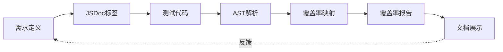

# Nomad 项目期末汇报

Requirements as Code 方法实践

—— TODO 小组

<a href="https://github.com/ukesjtu/nomad/graphs/contributors">
  
</a>

<!--
大家好，我们是 TODO 小组。今天我将为大家带来 Nomad 项目的期末汇报。这次汇报的主题是"Requirements as Code 方法实践"——我们将展示如何将需求管理从文档驱动转变为代码驱动，通过 Monorepo 架构实现需求的版本控制、可追溯性和自动化验证。
-->

---
layout: center
transition: slide-left
---

# 目录

<v-clicks>

1. **演示环节** - 展示目前实现的核心业务功能
2. **需求管理方法** - Requirements as Code 的创新实践
3. **需求-设计-测试-实现的闭环** - 如何达成稳定复现代码
4. **遇到的挑战与解决方案** - 实践中的问题和改进
5. **GUI测试运行情况** - TODO
6. **总结与展望** - 核心贡献和未来计划

</v-clicks>

<!--
今天的汇报主要分为六个部分：

[click] 首先是演示环节，我会通过视频展示 Nomad 机票预订系统的核心业务功能。

[click] 第二部分是需求管理方法，这是今天汇报的核心。我会介绍传统需求管理的痛点，以及我们的解决方案——Requirements as Code。

[click] 第三部分是需求-设计-测试-实现的闭环，我会详细展示如何通过JSDoc标签追溯、自动化覆盖率分析和文档系统动态展示来达成稳定复现的代码。

[click] 第四部分是遇到的挑战与解决方案。我会分享需求覆盖率不均衡、场景覆盖率低等问题的根因分析和改进计划。

[click] 第五部分是 GUI 测试运行情况，展示我们的 Playwright E2E 测试实践。

[click] 最后是总结与展望，回顾我们的核心贡献，并展望下一步的工作计划。

现在让我们开始第一部分。
-->

---
layout: section
transition: slide-up
---

# 一、演示环节

展示目前实现的核心业务功能

<!--
首先进入第一部分，演示环节。打开 apps/web dev 开发服务器，默认是未登录状态。利用开发模式提供的快速切换用户功能，选择一个用户进行登录。

进入用户后台查看该用户的个人信息，订单列表，以及乘机人信息管理。

切换到机票搜索页面，输入出发地、目的地和出发日期，进行机票搜索。TODO：必须固定好一组参数，避免现场找不到的问题

根据搜索到的机票结果，进入订票流程，展示乘机人选择与填写等功能。
-->

---
transition: slide-left
layout: section
---

# 二、需求管理方法

Requirements as Code 的创新实践

<!--
接下来进入今天汇报的核心部分——需求管理方法。

我们不只是实现了功能，更重要的是创新性地将需求管理从文档驱动转变为代码驱动。这种方法解决了传统需求管理的诸多痛点，让需求定义、测试覆盖和文档生成形成了一个自动化的闭环。
-->

---
transition: slide-up
layout: two-cols-header
---

## 2.1 传统需求管理的痛点

::left::

<v-clicks>

### 常见问题

- **需求与代码分离**
  - Word/Excel 文档难以同步
  - 需求变更追踪困难
  - 代码和文档容易脱节

- **测试覆盖率难以量化**
  - 无法准确知道哪些需求已测试
  - 人工统计费时费力
  - 容易遗漏边界场景

</v-clicks>

::right::

<v-clicks>

### AI 辅助开发的挑战

- **AI 生成测试的局限性**
  - 容易产生"幻觉"
  - 倾向于 Happy Path
  - 遗漏异常场景和边界条件

- **追溯性差**
  - 难以知道某个测试覆盖了哪个需求
  - 需求变更时难以找到相关测试
  - 缺乏自动化验证机制

</v-clicks>

<!--
首先让我们看看传统需求管理存在哪些痛点。

[click] 第一个问题是需求与代码分离。在传统模式下，需求通常写在 Word 或 Excel 文档中，与代码仓库是独立的。这导致需求变更时，文档和代码很难保持同步。需求文档往往成为开发初期的产物，后续维护不及时，最终变成"历史遗留文档"。

[click] 第二个问题是测试覆盖率难以量化。我们很难准确知道哪些需求已经被测试覆盖，哪些还没有。人工统计费时费力，而且容易遗漏边界场景。

[click] 在 AI 辅助开发的场景下，这些问题更加突出。AI 生成测试用例时容易产生"幻觉"，比如引用不存在的函数或变量。

[click] AI 还倾向于生成 Happy Path 测试，对异常场景和边界条件的覆盖不足。更重要的是，AI 生成的测试缺乏追溯性。我们很难知道某个测试覆盖了哪个需求，需求变更时也难以找到相关的测试代码。

这些痛点促使我们思考：能否用更好的方法来管理需求？
-->

---
transition: slide-up
layout: center
---

## 2.2 我们的解决方案：Requirements as Code

<v-clicks>

### 核心思想

将需求定义为 **TypeScript 代码**，纳入 **版本控制**

### 关键优势

- **类型安全** - TypeScript 类型定义保证需求结构一致
- **版本控制** - 需求变更可追溯，支持 Git Diff
- **模块化管理** - 按业务模块组织（用户、机票、订单、支付、UI/UX）
- **多应用共享** - 一次定义，多处消费（文档系统、主应用、覆盖率分析）

</v-clicks>

<!--
为了解决这些痛点，我们提出了 Requirements as Code 的解决方案。

[click] 核心思想很简单：将需求定义为 TypeScript 代码，纳入 Git 版本控制。

[click] 这种方法带来了四个关键优势：

首先是类型安全。TypeScript 的类型系统保证了需求结构的一致性。每个需求必须包含 ID、标题、描述、用户故事、验收标准、优先级等字段，否则编译不通过。

其次是版本控制。需求的每一次变更都会被 Git 记录，我们可以通过 git diff 查看需求的演变历史，也可以通过 git blame 找到某个需求的修改者。

第三是模块化管理。我们按业务模块组织需求，每个模块是一个独立的 TypeScript 文件，比如 user-module.ts、flight-module.ts、order-module.ts 等。这种组织方式让需求清晰易读，也便于维护。

最后是多应用共享。需求定义在 packages/requirements 包中，其他应用可以直接导入使用。文档系统用它来生成需求文档，测试系统用它来验证覆盖率，主应用也可以用它来做运行时验证。一次定义，多处消费，避免了重复劳动。
-->

---
transition: slide-up
layout: two-cols-header
---

## 2.2 实现架构（结合 Monorepo）

::left::

<v-clicks>

### 目录结构

```
packages/requirements/    ← 需求定义包（核心）
├── src/data/
│   ├── user-module.ts
│   ├── flight-module.ts
│   ├── order-module.ts
│   ├── payment-module.ts
│   └── ui-ux-module.ts
├── src/utils/
│   └── traceability/    ← 需求追溯系统
│       ├── parser.ts
│       ├── mapper.ts
│       └── reporter.ts
└── src/cli/
    └── coverage.ts      ← 自动化覆盖率分析
```

</v-clicks>

::right::

<v-clicks>

### 消费者应用

```
apps/docs/               ← 文档系统
├── components/
│   ├── RequirementStats.tsx
│   ├── RequirementDetail.tsx
│   └── RequirementToc.tsx
└── content/docs/requirements/

apps/web/                ← 主应用
├── app/_components/
│   └── *.test.tsx       ← 带需求标签的测试
└── coverage-report.json ← 覆盖率报告
```

### 工作流

需求定义 → 多应用消费 → 覆盖率分析

</v-clicks>

<!--
[click] 让我们看看 Requirements as Code 的实现架构。

在 Monorepo 中，我们有一个核心的 packages/requirements 包。它的 src/data 目录下有五个模块文件，分别定义了用户、机票、订单、支付和 UI/UX 相关的需求。

src/utils/traceability 目录包含了需求追溯系统的核心代码。parser.ts 负责解析测试文件中的 JSDoc 标签，mapper.ts 负责构建需求和测试的映射关系，reporter.ts 负责生成覆盖率报告。

src/cli 目录包含了命令行工具，可以通过 pnpm test:ac-coverage 命令生成覆盖率报告。

[click] 这个需求包被多个应用消费。

apps/docs 是文档系统，它导入需求定义，通过 React 组件动态展示需求统计、需求详情和目录导航。

apps/web 是主应用，它的测试文件通过 JSDoc 标签关联需求，覆盖率分析工具扫描这些标签，生成 coverage-report.json。

[click] 整个工作流非常清晰：在 packages/requirements 中定义需求，多个应用导入使用，最后通过覆盖率分析工具验证需求是否被测试覆盖。这形成了一个完整的闭环。
-->

---
transition: slide-up
layout: center
---

## 2.3 需求数量与结构

<v-clicks>

| 模块      | 需求数量 | 验收场景数 | 优先级分布                     |
| --------- | -------- | ---------- | ------------------------------ |
| 用户模块  | 12       | ~75        | Must: 6, Should: 6             |
| 机票模块  | 13       | ~95        | Must: 9, Should: 3, Could: 1   |
| 订单模块  | 12       | ~85        | Must: 8, Should: 4             |
| 支付模块  | 13       | ~75        | Must: 11, Should: 2            |
| UI/UX模块 | 12       | ~51        | Must: 8, Should: 4             |
| **总计**  | **62**   | **381**    | Must: 42, Should: 19, Could: 1 |

</v-clicks>

<v-click>

> 所有需求采用 BDD 风格（Given-When-Then），使用 MoSCoW 优先级管理

</v-click>

<!--
[click] 让我们看看需求的数量和结构。

我们总共定义了 62 个功能需求，涵盖了 5 个业务模块。

用户模块有 12 个需求，大约 75 个验收场景，优先级均衡，6 个 Must Have，6 个 Should Have。

机票模块有 13 个需求，大约 95 个验收场景，大部分是 Must Have，有 9 个核心需求，3 个 Should Have 和 1 个 Could Have。

订单模块有 12 个需求，大约 85 个验收场景，8 个核心需求，4 个次要需求。

支付模块有 13 个需求，大约 75 个验收场景，11 个核心需求，2 个次要需求。

UI/UX 模块有 12 个需求，大约 51 个验收场景，8 个核心需求，4 个次要需求。

总计 62 个需求，381 个验收场景。优先级分布是 42 个 Must Have，19 个 Should Have，1 个 Could Have。

[click] 所有需求都采用 BDD 风格，使用 Given-When-Then 格式编写验收标准。我们还使用 MoSCoW 方法对需求进行优先级管理，确保团队优先实现核心功能。
-->

---
transition: slide-left
layout: section
---

# 三、需求-设计-测试-实现的闭环

如何达成稳定复现代码

<!--
接下来进入第三部分，需求-设计-测试-实现的闭环。

在这一部分，我将详细展示我们如何通过双向追溯系统，将需求定义、测试代码、覆盖率分析和文档展示串联起来，形成一个自动化的质量保障体系。
-->

---
transition: slide-up
---

## 3.1 设计思路：双向追溯系统

<v-clicks>

### 完整工作流程



### 关键环节

1. **需求定义** → packages/requirements 定义 62 个需求、381 个场景
2. **JSDoc标签** → @requirement, @scenario 标记测试
3. **AST解析** → TypeScript Compiler API 提取标签
4. **覆盖率映射** → 构建需求↔测试、场景↔测试的双向映射
5. **覆盖率报告** → 识别未覆盖需求和场景
6. **文档展示** → apps/docs 动态展示需求状态

</v-clicks>

<!--
[click] 首先让我们看看双向追溯系统的设计思路。

整个流程是一个完整的闭环。从需求定义开始，我们在 packages/requirements 中定义了 62 个需求和 381 个验收场景。

开发人员编写测试时，通过 JSDoc 标签标记测试覆盖的需求和场景，比如 @requirement REQ-U01 和 @scenario 场景1。

覆盖率分析工具使用 TypeScript Compiler API 解析测试文件的 AST，提取出所有的 JSDoc 标签。

然后构建需求到测试、场景到测试的双向映射关系。这样我们就知道哪些需求被哪些测试覆盖，哪些场景被哪些测试验证。

基于这个映射关系，我们生成覆盖率报告，识别出未覆盖的需求和场景。

最后，文档系统从需求包导入数据，从覆盖率报告读取测试状态，动态展示需求的实现情况。

整个流程形成了一个闭环。如果覆盖率报告显示某个需求未覆盖，我们可以快速定位并补充测试。如果需求发生变更，我们可以通过追溯系统找到相关的测试代码并更新。
-->

---
transition: slide-up
layout: two-cols-header
---

## 3.2 方法1：JSDoc 标签追溯

::left::

<v-clicks>

### 标签语法

```typescript
/**
 * @requirement REQ-U01  ← 关联需求
 * @scenario 场景1       ← 关联验收场景
 */
describe("PhoneVerificationForm", () => {
  it("should render all form fields correctly", () => {
    // 测试实现
  });
});
```

### 继承规则

- **文件级** → describe 块 → test 块
- 子级标签覆盖父级标签
- 支持多需求、多场景关联

</v-clicks>

::right::

<v-clicks>

### 实际示例

```typescript {*}{maxHeight:'400px'}
/**
 * @requirement REQ-U01
 * Phone verification form component tests
 */

describe("PhoneVerificationForm", () => {
  /**
   * @scenario 场景1: 表单正确渲染
   */
  it("should render all form fields", () => {
    render(<PhoneVerificationForm />);

    expect(screen.getByLabelText(/手机号/))
      .toBeInTheDocument();
    expect(screen.getByLabelText(/验证码/))
      .toBeInTheDocument();
  });

  /**
   * @scenario 场景2: 验证码发送
   */
  it("should send verification code",
    async () => {
    // ...
  });
});
```

</v-clicks>

<!--
[click] 首先让我们看看 JSDoc 标签追溯的方法。

标签语法非常简单。我们使用 @requirement 标签关联需求 ID，使用 @scenario 标签关联验收场景。

标签可以放在文件级、describe 块或 it 块的注释中。

[click] 标签有继承规则。文件级的标签会被 describe 块继承，describe 块的标签会被 it 块继承。子级标签会覆盖父级标签。这种设计让我们可以在文件级声明通用的需求 ID，在具体测试中声明不同的场景。

我们还支持多需求和多场景关联。如果一个测试同时验证了多个需求或场景，可以写多个标签。

[click] 右边是一个实际示例。

在文件级注释中，我们声明这个测试文件关联 REQ-U01 需求。

在第一个测试中，我们声明关联场景1：表单正确渲染。测试验证了手机号和验证码输入框是否正确渲染。

在第二个测试中，我们声明关联场景2：验证码发送。

这种标记方式非常直观，开发人员在编写测试时就能明确测试的目的，同时也为自动化覆盖率分析提供了数据基础。
-->

---
transition: slide-up
layout: center
---

## 3.2 方法2：自动化覆盖率分析

<v-clicks>

### 实现原理

1. **AST 解析** - 使用 TypeScript Compiler API 解析测试文件
2. **标签提取** - 提取 JSDoc 标签（@requirement, @scenario）
3. **映射构建** - 构建需求→测试、场景→测试的双向映射
4. **标签验证** - 验证需求ID和场景ID是否有效
5. **统计计算** - 计算覆盖率、识别未覆盖项

### 工具链路

```bash
pnpm test:ac-coverage          # 生成覆盖率报告
pnpm test:ac-coverage --json   # JSON 格式输出
```

</v-clicks>

<!--
[click] 接下来看看自动化覆盖率分析的实现原理。

第一步是 AST 解析。我们使用 TypeScript Compiler API 解析测试文件，获取抽象语法树。

第二步是标签提取。遍历 AST，提取所有的 JSDoc 注释，解析出 @requirement 和 @scenario 标签。

第三步是映射构建。根据标签的继承规则，构建需求到测试、场景到测试的双向映射关系。

第四步是标签验证。检查提取出的需求 ID 和场景 ID 是否在需求定义中存在。如果不存在，说明标签写错了或需求已删除，需要提醒开发者修正。

第五步是统计计算。计算每个模块的需求覆盖率和场景覆盖率，识别未覆盖的需求和场景，统计测试分布情况。

[click] 使用非常简单，只需要运行 pnpm test:ac-coverage 命令，就能生成覆盖率报告。如果需要 JSON 格式，可以加上 --json 参数。
-->

---
transition: slide-up
layout: two-cols-header
---

## 覆盖率报告内容

::left::

<v-clicks>

### 报告结构

- **总体覆盖率统计**
  - 需求覆盖率
  - 场景覆盖率
  - 按优先级统计

- **各模块覆盖率**
  - 用户模块：83.3%
  - 机票模块：30.8%
  - 订单模块：41.7%
  - 支付模块：0%
  - UI/UX模块：0%

</v-clicks>

::right::

<v-clicks>

### 详细信息

- **未覆盖的需求列表**
  - 需求 ID
  - 需求标题
  - 优先级
  - 所属模块

- **未覆盖的场景列表**
  - 场景描述
  - 所属需求
  - 优先级

- **测试分布情况**
  - 每个需求的测试数量
  - 重复测试识别

</v-clicks>

<!--
[click] 覆盖率报告包含丰富的信息。

首先是总体覆盖率统计。报告显示需求覆盖率是 30.6%，场景覆盖率是 7.3%。我们还可以按优先级统计，比如 Must Have 需求的覆盖率是多少。

然后是各模块覆盖率。可以看到用户模块的覆盖率最高，达到 83.3%。机票模块是 30.8%，订单模块是 41.7%。支付模块和 UI/UX 模块的覆盖率是 0，这是我们需要重点改进的部分。

[click] 报告还提供了详细信息。

未覆盖的需求列表显示了哪些需求还没有测试，包括需求 ID、标题、优先级和所属模块。这让我们可以优先补充高优先级需求的测试。

未覆盖的场景列表显示了哪些验收场景还没有被验证。

测试分布情况显示了每个需求被多少个测试覆盖。如果某个需求被大量测试覆盖，可能存在重复测试，需要优化。

有了这些信息，我们可以制定有针对性的测试改进计划。
-->

---
transition: slide-up
layout: two-cols-header
---

## 3.3 方法3：文档系统动态展示

::left::

<v-clicks>

### 文档组件

```tsx {*}{maxHeight:'400px'}
// MDX 文档
import { userModule }
  from '@nomad/requirements/data';
import {
  RequirementStats,
  RequirementDetail
} from '@/components';

## 用户模块

用户模块包含 {userModule.requirements.length}
个功能需求。

<RequirementStats modules={[userModule]} />

{userModule.requirements.map((req) => (
  <RequirementDetail
    key={req.id}
    requirement={req}
  />
))}
```

</v-clicks>

::right::

<v-clicks>

### 展示内容

- **需求统计表格**
  - 需求数
  - 场景数
  - MoSCoW 分布

- **需求详情卡片**
  - 需求概述
  - 用户故事
  - 验收标准
  - 优先级

- **需求目录导航**
  - 按模块分类
  - 按优先级筛选

</v-clicks>

<!--
[click] 第三个方法是文档系统动态展示。

我们使用 MDX 格式编写文档，可以在 Markdown 中直接导入 TypeScript 模块和 React 组件。

在这个例子中，我们从 @nomad/requirements/data 导入 userModule，从 @/components 导入展示组件。

然后在文档中动态展示用户模块包含多少个需求。

RequirementStats 组件展示需求统计表格。

RequirementDetail 组件遍历所有需求，展示每个需求的详细信息。

[click] 文档系统展示的内容非常丰富。

需求统计表格显示需求数、场景数和 MoSCoW 优先级分布。

需求详情卡片显示需求概述、用户故事、验收标准和优先级。

需求目录导航支持按模块分类和按优先级筛选。

关键点是，文档完全从需求代码自动生成，无需手动维护。需求定义一旦更新，文档会自动同步。这解决了传统需求管理中文档与代码不同步的问题。
-->

---
transition: slide-up
layout: center
---

## 3.4 测试系统架构

<v-clicks>

### 4层测试金字塔

1. **单元测试（Unit Tests）** - 纯逻辑、工具函数
2. **组件测试（Component Tests）** - React 组件渲染和交互
3. **集成测试（Repository Tests）** - 数据库操作、数据层
4. **E2E测试（Playwright）** - 端到端业务流程

### 当前测试覆盖情况

- 测试文件：89 个
- Vitest 配置：4 个独立测试项目
- 覆盖率阈值：80%（branches, functions, lines, statements）

</v-clicks>

<!--
[click] 最后让我们看看测试系统的整体架构。

我们采用 4 层测试金字塔。

最底层是单元测试，测试纯逻辑和工具函数，比如数据脱敏、日期格式化等。

第二层是组件测试，测试 React 组件的渲染和交互，使用 React Testing Library。

第三层是集成测试，测试数据库操作和数据层逻辑，比如用户仓库、订单仓库等。

最顶层是 E2E 测试，使用 Playwright 测试端到端业务流程，比如完整的订票流程。

[click] 当前我们有 89 个测试文件，配置了 4 个独立的 Vitest 测试项目，覆盖率阈值设为 80%。

这套测试体系不仅保证了代码质量，更重要的是，它与需求管理系统深度集成。每个测试都明确标记了覆盖的需求和场景，形成了需求-测试-代码的完整追溯链条。
-->

---
transition: slide-left
layout: section
---

# 四、遇到的挑战与解决方案

实践中的问题和改进

<!--
接下来进入第四部分，遇到的挑战与解决方案。

在实践 Requirements as Code 的过程中，我们遇到了一些挑战。这些挑战也暴露了我们工作中需要改进的地方。我会坦诚地分享这些问题，以及我们的根因分析和改进计划。
-->

---
transition: slide-up
layout: two-cols-header
---

## 4.1 挑战1：需求覆盖率不均衡

::left::

<v-clicks>

### 现象

| 模块      | 覆盖率 | 状态      |
| --------- | ------ | --------- |
| 用户模块  | 83.3%  | ✅ 良好   |
| 机票模块  | 30.8%  | ⚠️ 待改进 |
| 订单模块  | 41.7%  | ⚠️ 待改进 |
| 支付模块  | 0%     | ❌ 需补充 |
| UI/UX模块 | 0%     | ❌ 需补充 |

### 根因分析

1. **组件设计问题**
   - 部分组件未遵循单一职责原则
   - 业务逻辑与 UI 耦合，难以拆分测试

</v-clicks>

::right::

<v-clicks>

### 根因分析（续）

2. **测试优先级**
   - 团队优先保证核心业务流程
   - 用户注册、订单查询优先实现

3. **AI 辅助局限**
   - AI 生成的测试倾向于 Happy Path
   - 边界场景覆盖不足

### 解决方案

- 重构支付模块：分离 Base 组件（UI）和 Web Adapter（业务逻辑）
- 利用覆盖率报告：优先补充 Must Have 需求的测试
- 建立测试模板：标准化 JSDoc 标签使用规范

</v-clicks>

<!--
[click] 第一个挑战是需求覆盖率不均衡。

从表格可以看到，用户模块的覆盖率达到了 83.3%，状态良好。但机票模块只有 30.8%，订单模块是 41.7%，支付模块和 UI/UX 模块更是 0%。

为什么会出现这种情况？我们做了根因分析。

首先是组件设计问题。我们发现部分组件没有遵循单一职责原则。比如支付流程组件，它同时包含了 UI 渲染和支付业务逻辑，导致测试时很难拆分。你要么测试整个流程，要么就没法测试。

[click] 其次是测试优先级的问题。在有限的开发时间内，团队优先保证了核心业务流程的质量，比如用户注册、订单查询这些基础功能。支付和 UI/UX 模块虽然重要，但测试的优先级相对较低。

第三是 AI 辅助的局限性。我们大量使用 AI 生成测试代码，但 AI 生成的测试倾向于 Happy Path，对边界场景和异常情况的覆盖不足。

[click] 针对这些问题，我们制定了解决方案。

首先是重构支付模块。我们将 Base 组件（纯 UI）和 Web Adapter（业务逻辑）分离，让组件更容易测试。

其次是利用覆盖率报告。报告已经明确告诉我们哪些 Must Have 需求还没有测试，我们可以有针对性地补充。

最后是建立测试模板。我们会标准化 JSDoc 标签的使用规范，让所有团队成员都能正确标记测试。
-->

---
transition: slide-up
layout: two-cols-header
---

## 4.2 挑战2：场景覆盖率低（7.3%）

::left::

<v-clicks>

### 现象

- **总场景数**：381 个验收场景
- **已覆盖**：28 个场景
- **覆盖率**：7.3%

### 原因

1. **场景数量多**
   - 单个需求包含 5-10 个验收场景
   - Happy Path + 多个异常场景

2. **当前测试主要覆盖 Happy Path**
   - 正常注册流程 ✅
   - 手机号已注册 ❌
   - 验证码错误 ❌
   - 网络异常 ❌

</v-clicks>

::right::

<v-clicks>

### 改进计划

1. **优先级驱动**
   - 使用覆盖率报告识别高优先级未覆盖场景
   - Must Have 需求优先

2. **测试驱动开发（TDD）**
   - 先写测试，再实现功能
   - 确保每个场景都有对应测试

3. **Property-Based Testing**
   - 引入 fast-check 等工具
   - 提升边界场景覆盖

4. **测试评审机制**
   - Code Review 时检查场景覆盖
   - 新增功能必须包含场景测试

</v-clicks>

<!--
[click] 第二个挑战是场景覆盖率低，只有 7.3%。

我们有 381 个验收场景，但只有 28 个被测试覆盖。

原因是什么呢？

首先是场景数量确实很多。我们在定义需求时，为每个需求编写了详细的验收场景。一个需求通常包含 5 到 10 个场景，包括 Happy Path 和多个异常场景。

其次是当前测试主要覆盖 Happy Path。比如用户注册功能，我们测试了正常注册流程，但没有测试手机号已注册、验证码错误、网络异常等场景。

[click] 针对这个问题，我们制定了详细的改进计划。

第一是优先级驱动。我们会使用覆盖率报告识别高优先级的未覆盖场景，优先补充 Must Have 需求的场景测试。

第二是采用测试驱动开发。先写测试，再实现功能，确保每个场景都有对应的测试。

第三是引入 Property-Based Testing。使用 fast-check 等工具，自动生成测试用例，提升边界场景的覆盖。

第四是建立测试评审机制。在 Code Review 时检查场景覆盖情况，新增功能必须包含场景测试，不能只测试 Happy Path。

这些改进措施将帮助我们提升场景覆盖率，让测试更加全面。
-->

---
transition: slide-up
layout: center
---

## 4.3 挑战3：Monorepo 维护复杂度

<v-clicks>

### 问题

- **组件迁移工作量大**
  - 140 个组件，已完成 117 个
  - 需要重构 Base 组件和 Web Adapter

- **版本依赖管理复杂**
  - 多个应用依赖同一个包
  - 版本不一致可能导致构建失败

- **构建缓存策略优化**
  - Turborepo 缓存配置
  - CI/CD 流水线优化

### 解决措施

- 使用 Turborepo 优化构建流程
- 制定 Base Component Pattern 规范
- 渐进式迁移，避免大爆炸式重构

</v-clicks>

<!--
[click] 第三个挑战是 Monorepo 的维护复杂度。

Monorepo 带来了很多好处，比如代码共享、统一构建、原子化提交等。但同时也增加了维护复杂度。

首先是组件迁移工作量大。我们有 140 个组件，目前已经完成了 117 个的迁移。每个组件都需要重构为 Base 组件和 Web Adapter，工作量很大。

其次是版本依赖管理复杂。Monorepo 中有多个应用，它们可能依赖同一个包的不同版本。如果版本不一致，可能导致构建失败或运行时错误。

第三是构建缓存策略优化。我们使用 Turborepo 管理构建，需要正确配置缓存策略，否则会导致不必要的重复构建，影响 CI/CD 流水线的效率。

[click] 针对这些问题，我们采取了一些措施。

首先是使用 Turborepo 优化构建流程。Turborepo 可以根据依赖关系并行构建，利用缓存避免重复构建。

其次是制定 Base Component Pattern 规范。明确组件的拆分标准，让团队成员统一实施。

最后是渐进式迁移。我们不做大爆炸式重构，而是逐步迁移组件，确保每一步都是可控的。

这些措施帮助我们更好地管理 Monorepo 的复杂度。
-->

---
transition: slide-left
layout: section
---

# 五、GUI测试运行情况

E2E测试的实践

<!--
接下来进入第五部分，GUI 测试运行情况。

在这一部分，我将展示我们的 Playwright E2E 测试实践，包括测试范围、CI/CD 集成和未来改进方向。
-->

---
transition: slide-up
layout: two-cols-header
---

## Playwright E2E 测试

::left::

<v-clicks>

### 测试范围

- **首页功能测试**
  - 页面正确渲染
  - 导航功能
  - 响应式布局
  - 共 4 个测试用例

- **法律页面导航测试**
  - 隐私政策
  - 服务条款
  - 用户协议等
  - 共 5 个测试用例

</v-clicks>

::right::

<v-clicks>

### CI/CD 集成

- **4 分片并行执行**
  - 提升测试速度
  - 每个分片独立运行

- **跨浏览器测试**
  - Chromium
  - Firefox
  - WebKit

- **自动生成报告**
  - HTML 报告
  - 部署到 GitHub Pages
  - 访问地址：[playwright-report](https://ukesjtu.github.io/nomad/playwright-report/)

</v-clicks>

<!--
[click] 首先看看测试范围。

我们目前有两类 E2E 测试。

第一类是首页功能测试，包括页面正确渲染、导航功能、响应式布局等，共 4 个测试用例。

第二类是法律页面导航测试，测试隐私政策、服务条款、用户协议等页面的可访问性，共 5 个测试用例。

这些测试保证了用户界面的基本功能正常工作。

[click] 在 CI/CD 集成方面，我们做了一些优化。

首先是 4 分片并行执行。Playwright 支持将测试拆分为多个分片，并行运行，大大提升了测试速度。

其次是跨浏览器测试。我们在 Chromium、Firefox 和 WebKit 三个浏览器上运行测试，确保兼容性。

最后是自动生成报告。每次 CI 运行后，Playwright 会生成 HTML 报告，并自动部署到 GitHub Pages。团队成员可以通过链接查看详细的测试结果和失败截图。
-->

---
transition: slide-up
layout: center
---

## 待改进方向

<v-clicks>

### 1. 为 E2E 测试添加需求标签

- 当前 E2E 测试没有 `@requirement` 标签
- 需要将 E2E 测试纳入覆盖率统计
- 让需求追溯系统覆盖所有测试层级

### 2. 扩展核心业务流程的 E2E 测试

- **完整的订票流程**
  - 用户注册/登录
  - 搜索航班
  - 选择航班
  - 填写乘客信息
  - 完成支付
  - 查看订单

- **其他关键流程**
  - 密码找回
  - 个人信息修改
  - 订单取消

</v-clicks>

<!--
[click] 虽然我们已经有了 E2E 测试，但还有改进空间。

第一个改进方向是为 E2E 测试添加需求标签。当前 E2E 测试没有 @requirement 标签，所以没有被纳入覆盖率统计。我们需要为每个 E2E 测试添加标签，让需求追溯系统覆盖所有测试层级，从单元测试到 E2E 测试。

[click] 第二个改进方向是扩展核心业务流程的 E2E 测试。

我们需要为完整的订票流程编写 E2E 测试，覆盖从用户注册、搜索航班、选择航班、填写乘客信息、完成支付到查看订单的整个流程。

除了订票流程，我们还需要为密码找回、个人信息修改、订单取消等关键流程编写 E2E 测试。

这些 E2E 测试将从用户视角验证系统功能，确保端到端的业务流程正常工作。
-->

---
transition: slide-left
layout: section
---

# 六、总结与展望

核心贡献和未来计划

<!--
最后进入第六部分，总结与展望。

让我回顾一下我们在这个项目中的核心贡献，以及未来的工作计划。
-->

---
transition: slide-up
layout: two-cols-header
---

## 核心贡献

::left::

<v-clicks>

### 1. 创新方法

**Requirements as Code**

- 需求管理的代码化实践
- 从文档驱动到代码驱动
- 业界少见的系统性实践

### 2. 工程化实现

**自动化追溯系统**

- JSDoc 标签追溯
- AST 解析和映射构建
- 覆盖率报告生成
- 避免人工遗漏和错误

</v-clicks>

::right::

<v-clicks>

### 3. Monorepo 架构

**需求、文档、应用的统一管理**

- packages/requirements：需求定义
- apps/docs：文档系统
- apps/web：主应用
- 一次定义，多处消费

### 4. 类型安全

**TypeScript 保证需求定义的一致性**

- 编译时验证
- 重构时自动提示
- IDE 智能提示

</v-clicks>

<!--
[click] 首先是创新方法——Requirements as Code。

我们将需求管理从文档驱动转变为代码驱动。这不是简单地把需求写成代码格式，而是充分利用了代码的版本控制、类型检查、自动化验证等特性。据我所知，这是业界少见的系统性实践。

[click] 其次是工程化实现——自动化追溯系统。

我们不依赖人工维护需求和测试的映射关系，而是通过 JSDoc 标签、AST 解析、映射构建等技术手段，自动化地追溯需求和测试的关系。这避免了人工遗漏和错误，让追溯系统真正可用。

[click] 第三是 Monorepo 架构——需求、文档、应用的统一管理。

我们将需求定义、文档系统、主应用放在同一个 Monorepo 中。需求定义在 packages/requirements，文档系统在 apps/docs，主应用在 apps/web。一次定义，多处消费，形成了完整的闭环。

[click] 最后是类型安全——TypeScript 保证需求定义的一致性。

需求定义使用 TypeScript 类型，编译时就能验证结构是否正确。重构时 IDE 会自动提示哪些地方需要修改，大大降低了维护成本。
-->

---
transition: slide-up
layout: center
---

## 效果验证

<v-clicks>

### ✅ 需求总数清晰可查

- **62 个需求**，**381 个验收场景**
- 按模块组织，按优先级管理

### ✅ 覆盖率可量化

- **总体需求覆盖率：30.6%**
- **用户模块覆盖率：83.3%**
- 识别未覆盖的高优先级需求

### ✅ 需求变更可追溯

- **Git 历史记录所有变化**
- git diff 查看需求演变
- git blame 找到修改者

### ✅ 文档自动同步

- **apps/docs 动态读取需求数据**
- 需求更新，文档自动同步
- 避免文档与代码不一致

</v-clicks>

<!--
[click] 让我们看看 Requirements as Code 的效果验证。

第一个效果是需求总数清晰可查。我们有 62 个需求，381 个验收场景，按模块组织，按优先级管理。任何人都可以快速了解系统的需求全貌。

[click] 第二个效果是覆盖率可量化。我们可以精确知道总体需求覆盖率是 30.6%，用户模块覆盖率是 83.3%。我们还能识别出未覆盖的高优先级需求，有针对性地改进。

[click] 第三个效果是需求变更可追溯。所有需求变更都被 Git 记录。我们可以通过 git diff 查看某个需求的演变历史，通过 git blame 找到某次修改的责任人。这让需求管理变得透明和可追溯。

[click] 第四个效果是文档自动同步。apps/docs 文档系统动态读取需求数据，需求更新后文档会自动同步。这彻底解决了传统需求管理中文档与代码不一致的问题。

这些效果证明了 Requirements as Code 方法的有效性。
-->

---
transition: slide-up
layout: center
---

## 下一步计划

<v-clicks>

### 1. 提升测试覆盖率

- **支付模块和 UI/UX 模块**：从 0% 提升至 60%
- **场景覆盖率**：从 7.3% 提升至 30%
- 优先补充 Must Have 需求的测试

### 2. 为 E2E 测试添加需求标签

- 将 E2E 测试纳入覆盖率统计
- 实现从单元测试到 E2E 测试的完整追溯

### 3. 扩展核心业务流程的 E2E 测试

- 完整的订票流程
- 密码找回、个人信息修改等关键流程

### 4. 引入突变测试（Mutation Testing）

- 使用 Stryker 等工具验证测试质量
- 识别"假阳性"测试

</v-clicks>

<!--
[click] 最后让我们展望一下未来的工作计划。

第一是提升测试覆盖率。我们计划将支付模块和 UI/UX 模块的覆盖率从 0% 提升至 60%，将场景覆盖率从 7.3% 提升至 30%。优先补充 Must Have 需求的测试。

[click] 第二是为 E2E 测试添加需求标签。将 E2E 测试纳入覆盖率统计，实现从单元测试到 E2E 测试的完整追溯。

[click] 第三是扩展核心业务流程的 E2E 测试。为完整的订票流程、密码找回、个人信息修改等关键流程编写 E2E 测试。

[click] 第四是引入突变测试。使用 Stryker 等工具进行突变测试，验证测试的质量。突变测试会故意修改代码，看测试能否发现这些错误。这能帮助我们识别"假阳性"测试——那些看起来能通过，但实际上没有真正验证代码逻辑的测试。

这些改进将进一步提升我们的测试质量和需求管理水平。
-->

---
layout: center
transition: slide-left
---

# 感谢聆听

<v-clicks>

## 附录：关键文件路径

### 需求定义

- `packages/requirements/src/data/user-module.ts`
- `packages/requirements/src/data/flight-module.ts`
- `packages/requirements/src/data/order-module.ts`
- `packages/requirements/src/data/payment-module.ts`
- `packages/requirements/src/data/ui-ux-module.ts`

### 追溯系统

- `packages/requirements/src/cli/coverage.ts` - CLI 工具入口
- `packages/requirements/src/utils/traceability/parser.ts` - AST 解析器
- `packages/requirements/src/utils/traceability/mapper.ts` - 覆盖率映射
- `packages/requirements/src/utils/traceability/reporter.ts` - 报告生成

</v-clicks>

<!--
感谢大家的聆听！

[click] 这里列出了一些关键文件的路径，方便大家查阅。

需求定义文件在 packages/requirements/src/data 目录下，按模块组织。

追溯系统的核心代码在 packages/requirements/src/utils/traceability 目录下，包括 AST 解析器、覆盖率映射和报告生成。

CLI 工具入口在 packages/requirements/src/cli/coverage.ts，这是覆盖率分析的入口。

如果大家对 Requirements as Code 方法感兴趣，欢迎查看我们的代码仓库，也欢迎提出宝贵的意见和建议。

谢谢大家！
-->

---
layout: end
---

# Q&A

欢迎提问

<!--
现在进入提问环节，欢迎大家提问。
-->
