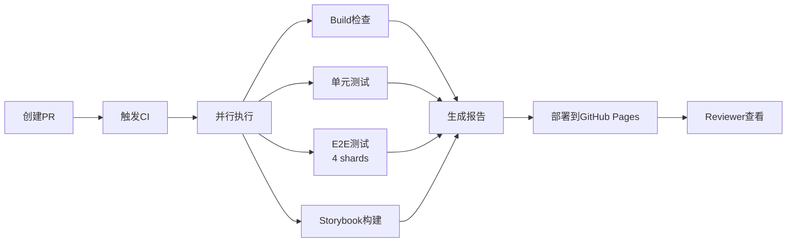

## Nomad 项目第二次中期汇报大纲

---

### 一、项目进度汇报 (5-7分钟)

#### 1.1 已完成的核心功能模块

**展示方式建议**: 功能演示视频 + 关键代码截图

**功能清单**:

- **用户认证系统**
  - 多种登录方式:手机号OTP、邮箱OTP、GitHub OAuth
  - 密码加密存储(Better Auth)

- **个人信息管理**
  - 用户资料编辑
  - 常用旅客CRUD(增删改查)
  - 数据验证(Zod schema)

- **航班搜索系统**
  - 单程/往返航班搜索
  - 多维度筛选(价格、时间、舱位)
  - 搜索历史记录(自动去重、计数)
  - 快速日期价格查询(附近7天最低价)

- **数据库设计**
  - 完整的Schema:城市、机场、航空公司、航班、座位等级、搜索历史
  - 软删除机制
  - 索引优化

#### 1.2 开发中的功能

- 订单管理系统
- 支付功能(模拟支付/退款)

**演示建议**:
- 录制一个2-3分钟的功能演示视频,展示完整的用户旅程
- 或者准备关键页面的截图,配合讲解

---

### 二、开发者体验 - 我们的差异化优势 (10-12分钟)

> **核心论点**: 我们不只是实现了功能,更建立了一套完整的工程化开发体系

#### 2.1 测试体系 - 三层测试金字塔保证代码质量

**为什么这是差异化优势**:
- 大多数小组可能只写了少量测试,或者根本没有测试
- 我们建立了从单元到E2E的完整测试覆盖

**展示内容**:

**单元测试 (Vitest)**
- 测试业务逻辑、工具函数
- 代码覆盖率追踪
- 示例:展示一个邮件发送服务的单元测试

```typescript
// src/lib/email.test.ts
describe("sendEmailOtp", () => {
  it("should send email successfully with valid configuration", async () => {
    // Setup environment variables
    env.RESEND_API_KEY = "re_test_key";
    env.RESEND_FROM_EMAIL = "test@example.com";

    // Mock successful response
    mockSendEmail.mockResolvedValue({
      data: { id: "test-email-id" },
      error: null,
    });

    const result = await sendEmailOtp("user@example.com", "123456");

    expect(result).toBe(true);
    expect(mockSendEmail).toHaveBeenCalledWith({
      from: "test@example.com",
      to: "user@example.com",
      subject: "Nomad - 验证您的邮箱",
      react: expect.anything(),
    });
  });
});
```

**组件测试 (Storybook + Vitest)**
- 隔离测试UI组件
- 可视化回归测试
- 示例:展示Storybook界面,演示主题切换

**E2E测试 (Playwright)**
- 模拟真实用户流程
- 4个shard并行执行,提升速度
- 示例:展示一个完整的登录流程测试

**数据支撑**:
- 测试覆盖率: XX%
- E2E测试用例数: XX个
- CI中测试执行时间: XX秒

---

#### 2.2 Storybook - 组件库与业务逻辑分离

**为什么这是差异化优势**:
- 其他小组可能UI和业务逻辑耦合严重,难以复用和测试
- 我们通过Storybook实现了组件的独立开发和展示

**展示内容**:
- **在线Storybook地址**: 展示实际部署的Storybook
- **主题切换演示**: 展示亮色/暗色主题切换
- **无障碍测试**: 展示a11y addon的使用

**核心价值**:
- 设计师/产品经理可以直接查看组件样式,无需运行整个项目
- 新成员可以快速了解可用组件
- 组件复用率提升

---

#### 2.3 完善的文档系统 - 降低协作成本

**为什么这是差异化优势**:
- 大多数小组可能只有一个简单的README
- 我们有完整的技术文档站,支持搜索、图表、代码高亮

**展示内容**:
- **在线文档地址**: 展示实际部署的文档站
- **决策文档**: 展示OpenSpec中的重大变更记录(假设已合并)
- **技术栈文档**: 展示架构图、测试策略等

**文档类型**:
- 技术设计文档(架构、测试策略)
- API文档
- 开发指南
- 决策记录(ADR)

---

#### 2.4 CI/CD - 自动化质量保障的核心

**为什么这是差异化优势**:
- 其他小组可能手动测试,容易遗漏
- 我们的每次PR都会自动触发完整的质量检查

**CI流程展示**:



**CI的价值**:
1. **自动化测试**: PR创建时自动运行所有测试
2. **测试覆盖率报告**: 自动上传到Codecov,可视化覆盖率变化
3. **Storybook预览**: 每个PR都有独立的Storybook预览链接
4. **E2E测试报告**: 失败时自动生成截图和视频

**CD的价值**:
1. **自动部署到Vercel**: 每次合并到主分支自动部署
2. **在线文档**: 文档自动部署,始终保持最新
3. **Preview Deployment**: 每个PR都有独立的预览环境

**演示建议**:
- 展示一个实际的PR,指出CI检查项
- 展示GitHub Pages上的测试报告、Storybook、覆盖率报告

---

### 三、小组间协作 - 为课程考核做准备 (3-5分钟)

> **背景**: 课程后续有两个环节 - 在其他组代码上增加功能 + 找bug

#### 3.1 Issue #106 - 开发常见问题FAQ

**目的**: 帮助其他组快速上手我们的项目

**内容**:
- 开发环境配置问题
- Next.js 15 + Turbopack常见坑
- 数据库相关问题
- 测试相关问题

**示例问题**:
- A1: Next.js 15 + Turbopack在Windows环境下无法解析Google Fonts模块
  - 问题描述、重现步骤、解决方案、相关概念

**价值**:
- 其他组在我们代码上开发时,可以快速找到解决方案
- 减少重复问题的沟通成本
- 展现我们的文档意识

---

#### 3.2 High-Risk文档 - 常见安全漏洞清单

**目的**: 帮助其他组自查代码,同时也是我们找bug的参考

**内容结构**:
- **P0级漏洞**(必考虑): 价格篡改、横向越权、输入验证、SQL注入、认证安全、敏感信息泄露
- **P1级漏洞**(应考虑): 订单并发、状态机漏洞、支付倒计时、频率限制、OTP安全、退款逻辑
- **P2级漏洞**(超纲): CSRF、XSS、敏感数据加密

**每个漏洞包含**:
- 业务场景
- 漏洞描述
- 测试方法(具体步骤)
- 正确实现方式
- 测试数据/脚本

**示例展示**:

**价格篡改漏洞**:
```json
// 恶意请求示例
POST /api/orders
{
  "flightId": "CA1234",
  "passengers": ["passenger1", "passenger2"],
  "totalPrice": 1  // 篡改为 1 元
}
```

**正确实现**:
- 后端根据航班ID、舱位、乘客数量**重新计算价格**
- 直接使用 `request.body.price` 写入订单(错误做法)

**价值**:
- 其他组可以用这个清单自查代码
- 我们在找bug环节可以快速定位常见漏洞
- 展现我们对业务安全的重视

---

### 四、项目展望 - 技术升级方向 (3-5分钟)

> **核心思路**: 基于现有代码,说明具体的优化场景

#### 4.1 Redis缓存 - 提升查询性能

**应用场景**:

**航班搜索结果缓存**
- **现状**: 每次搜索都查询数据库,涉及多表JOIN
- **优化**: 缓存热门航线的搜索结果(如上海-北京)
- **缓存策略**:
  - Key: `flight:search:{from}:{to}:{date}:{class}`
  - TTL: 5分钟(航班信息变化不频繁)
  - 失效策略: 航班信息更新时主动清除

**快速日期价格缓存**
- **现状**: 查询附近7天价格需要7次数据库查询
- **优化**: 缓存每个航线的7天价格数据
- **代码位置**: `src/lib/actions/quick-date-prices.ts`

```typescript
async function getOneWayQuickPrices(params: {
  from: string;
  to: string;
  dates: Date[];
  classType?: "ECONOMY" | "BUSINESS" | "FIRST";
}): Promise<QuickDatePrice[]> {
  // 当前实现:循环查询数据库
  // 优化方向:先查Redis缓存,未命中再查数据库
}
```

**城市/机场数据缓存**
- **现状**: 每次搜索都查询城市和机场信息
- **优化**: 启动时加载到Redis,几乎不变的数据
- **代码位置**: `src/lib/repositories/cities.ts`

**预期收益**:
- 搜索响应时间从 200ms 降低到 50ms
- 数据库负载降低 70%
- 支持更高并发

---

#### 4.2 消息队列 - 异步处理提升响应速度

**应用场景**:

**邮件发送异步化**
- **现状**: 注册/订单确认时同步调用Resend API,可能阻塞3-5秒
- **优化**: 将邮件发送任务放入消息队列,立即返回
- **代码位置**: `src/lib/email.tsx`

```typescript
public async sendVerificationEmail(
  emailAddr: string,
  code: string
): Promise<boolean> {
  // 当前实现:同步调用Resend API
  const { data, error } = await this.client.emails.send({...});

  // 优化方向:发送到消息队列,异步处理
  // await messageQueue.publish('email', { emailAddr, code });
}
```

**短信发送异步化**
- **现状**: 手机号登录时同步调用阿里云SMS,可能阻塞2-3秒
- **优化**: 消息队列异步发送
- **代码位置**: `src/lib/sms.ts`

**搜索历史记录异步化**
- **现状**: 搜索完成后同步写入数据库
- **优化**: 通过消息队列异步写入,不影响搜索响应
- **代码位置**: `src/lib/actions/flight-search-history.ts`

```typescript
export async function recordSearchHistory(
  params: RecordSearchHistoryParams
): Promise<void> {
  // 当前实现:同步写入数据库
  // 优化方向:发送到消息队列,异步处理
}
```

**技术选型**:
- **BullMQ** (基于Redis的消息队列)
- **优势**: 支持延迟任务、重试机制、优先级队列

**预期收益**:
- 注册/登录响应时间从 5秒 降低到 500ms
- 用户体验显著提升
- 系统解耦,易于扩展

---

#### 4.3 其他优化方向

**数据库连接池优化**
- 当前使用默认连接池配置
- 可根据并发量调整连接数

**CDN加速**
- 静态资源(图片、字体)使用CDN
- 减少服务器带宽压力

**服务端渲染优化**
- 利用Next.js 15的Partial Prerendering
- 提升首屏加载速度

---

### 五、总结 (1-2分钟)

**我们的核心优势**:
1. **完整的工程化体系** - 不只是完成功能,更注重质量
2. **三层测试金字塔** - 从单元到E2E的全方位覆盖
3. **自动化CI/CD** - 每次PR都有质量保障
4. **完善的文档** - 降低协作成本
5. **前瞻性思考** - 已规划Redis和MQ优化方案

**我们不只是实现了一个机票预订系统,更建立了一套可持续、可扩展的工程化开发体系。**

---

## 演示素材准备清单

### 必备素材
- 功能演示视频(2-3分钟)或关键页面截图
- GitHub Actions CI运行截图
- Storybook在线地址 + 主题切换演示
- 测试覆盖率报告截图(Codecov)
- E2E测试报告截图(Playwright)
- 在线文档地址
- Issue #106截图
- High-Risk文档截图

### 可选素材
- 架构图(Mermaid)
- CI/CD流程图
- 测试金字塔图
- Redis缓存架构图
- 消息队列架构图

---

## 演讲技巧建议

### 开场(抓住注意力)
> "今天我们不只是展示功能,更重要的是展示**我们如何保证代码质量**、**如何提升开发效率**、**如何为后续的组间协作做准备**。"

### 第二部分(核心亮点)
> "当其他小组还在手动测试时,我们的每次提交都会自动触发完整的测试套件。当其他小组在讨论'这个组件长什么样'时,我们直接发一个Storybook链接。"

### 第三部分(展现格局)
> "我们不只是为自己开发,也为其他组着想。Issue #106帮助他们快速上手,High-Risk文档帮助他们自查代码。这不仅是技术能力,更是协作意识。"

### 第四部分(技术深度)
> "我们不只是说'要用Redis',而是基于现有代码,明确指出**哪些查询**可以缓存、**哪些API调用**可以异步化,这是真正的工程思维。"

### 结尾(升华主题)
> "我们的目标不是'能跑就行',而是'跑得好、跑得稳、跑得快'。这套工程化体系,不仅适用于这个课程项目,更是我们未来职业生涯的宝贵经验。"
