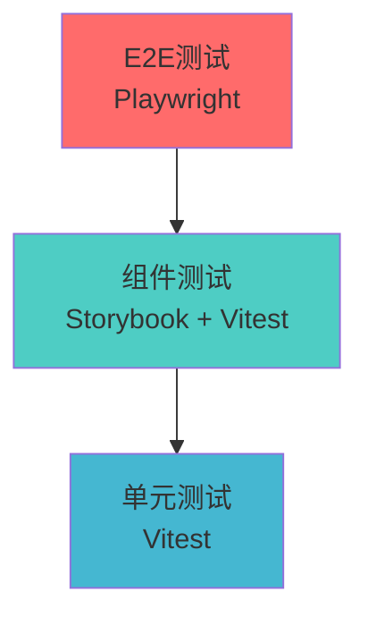
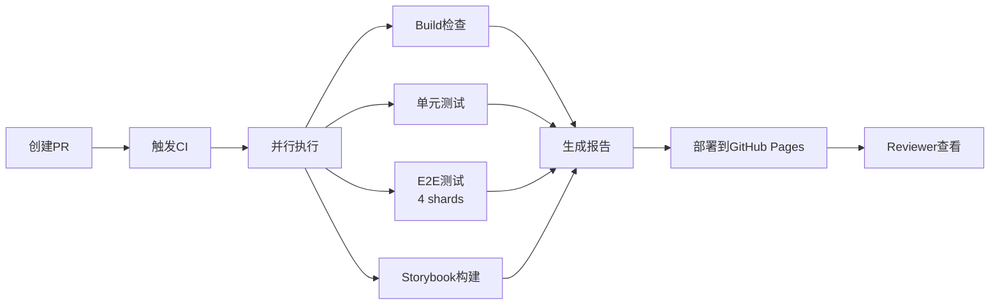

# Nomad 项目中期汇报

第二次中期汇报——协作与进展

—— TODO 小组

<a href="https://github.com/ukesjtu/nomad/graphs/contributors">
  
</a>

<!--
大家好，我们是 TODO 小组，选题是“携程平台”。今天我将为大家带来Nomad项目的第二次中期汇报。这次汇报的主题是"协作与进展"，我们不仅会展示项目的功能进展，更重要的是展示我们如何通过完善的工程化体系来保证代码质量、提升开发效率，以及如何为后续的组间协作做好准备。
-->

---
layout: center
transition: slide-left
---

# 汇报大纲

<v-clicks>

1. **项目进度汇报** - 当前软件系统完成的情况
2. **测试框架设计** - 如何用良好的测试框架设计提高AI+TDD开发的效率
   - 三层测试金字塔
   - Storybook组件库
   - 完善的文档系统
   - CI/CD自动化流程
3. **AI生成失败** - 为何失败？如何解决？
4. **团队协作情况** - 我们是如何提高团队协作效率的

</v-clicks>

<!--
今天的汇报分为四个部分：

[click] 首先是项目进度汇报，我会简要介绍我们对需求场景的分解与设计。

[click] 第二部分是今天的重点——开发者体验。这是我们的差异化优势所在。我们不只是实现了功能，更建立了一套完整的工程化开发体系，包括三层测试金字塔、Storybook组件库、完善的文档系统，以及CI/CD自动化流程。

[click] 第三部分是小组间协作。考虑到课程后续有在其他组代码上增加功能和找bug的环节，我们提前准备了开发常见问题FAQ和安全漏洞清单，帮助其他组快速上手我们的项目。

[click] 最后是项目展望，我会基于现有代码，说明具体的技术优化方向，包括Redis缓存和消息队列的应用场景。

现在让我们开始第一部分。
-->

---
layout: section
transition: slide-up
---

# 一、项目进度汇报

当前软件系统完成的情况

<!--
首先进入第一部分，项目进度汇报。在这一部分，我将向大家展示我们已经完成的四大核心功能模块。这些模块涵盖了从用户注册登录，到个人信息管理，再到航班搜索和订单处理的完整业务流程。值得强调的是，我们不仅实现了基础功能，还在每个环节都考虑了用户体验和安全性。
-->

---
transition: slide-up
layout: center
---

## 1.1 用户认证模块

<v-clicks>

- 用户注册：手机号或邮箱注册的方式
- 用户登录：手机号+验证码，手机号+密码，邮箱+验证码，邮箱+密码多种方式登录
- 第三方集成：提供 GitHub OAuth 的方式登录
- 忘记密码：通过手机号或邮箱找回密码/重新设置密码
- 人机验证：集成人机验证模块保护关键接口

</v-clicks>

<v-click>

> 值得一提的是，我们引入了阿里云的短信发送服务和 Resend 提供的邮件发送服务，能够真的发送注册短信等等

</v-click>

<!--
首先是用户认证模块，这是整个系统的入口。

[click] 我们支持多样化的注册方式，用户可以选择使用手机号或邮箱进行注册，降低注册门槛。

[click] 在登录方面，我们提供了四种组合方式：手机号加验证码、手机号加密码、邮箱加验证码、邮箱加密码。这种灵活的设计既保证了安全性，又兼顾了用户体验。所有密码都使用Better Auth框架进行加密存储，确保数据安全。

[click] 我们还集成了GitHub OAuth第三方登录，来替代携程平台上微信、QQ等社交账号登录方式。

[click] 考虑到用户可能忘记密码的场景，我们提供了完整的密码找回流程，支持通过手机号或邮箱重置密码。

[click] 为了防止恶意注册、暴力破解等安全威胁，我们集成了人机验证模块。在关键操作节点，比如注册、登录、发送验证码等场景，系统会要求用户完成人机验证，有效防止机器人攻击和恶意刷单行为，保障系统安全和服务质量。

[click] 特别值得一提的是，我们引入了真实的第三方服务：阿里云的短信服务用于发送验证码，Resend服务用于发送邮件。这两项功能目前还在调试中，希望能在下一次展示中稳定部署让大家体验。这不是简单的模拟，而是真正可用的生产级别功能。
-->

---
transition: slide-up
layout: center
---

## 1.2 用户后台模块

<v-clicks>

- 个人信息管理：查看/编辑，性别、昵称等等
- 常用旅客信息管理：查看，新增，删除，修改
- 订单分类查看：查看/删除个人订单记录
- 第三方账号绑定：绑定/解绑第三方账户（GitHub OAuth)
- 账号安全设置：修改密码/绑定手机号/绑定邮箱

</v-clicks>

<!--
第二个模块是用户后台，这是用户管理个人信息和订单的中心。

[click] 在个人信息管理方面，用户可以查看和编辑自己的基本信息，包括性别、昵称等。

[click] 在常用旅客信息管理中，用户可以预先保存乘客信息，订票时直接选择，无需重复输入。我们提供了完整的增删改查功能，并通过Zod schema严格验证所有输入数据，确保信息的准确性和完整性。

[click] 订单管理功能支持按状态分类查看订单，比如待付款、已完成、已取消等。用户可以快速查看历史订单，也可以删除不需要的订单记录。

[click] 第三方账号绑定功能让用户可以关联或解除GitHub账号。

[click] 账号安全设置也很重要。用户可以修改密码、绑定或更换手机号以及邮箱。
-->

---
transition: slide-up
layout: center
---

## 1.3 航班搜索模块

<v-clicks>

- 航班搜索：可选择单程/往返，选择座舱等级，出发地，到达地，出发日期，返程日期
- 航班搜索历史记录：跟踪用户过往搜索历史记录，通过点击快速重新搜索
- 搜索结果展示：可以按价格/飞行时间等排序，或者按照航司/座舱等级等进行筛选
- 快速日期价格查询（附近7天最低价）

</v-clicks>

<!--
第三个模块是航班搜索，这是我们系统的核心功能。

[click] 在搜索功能方面，我们支持单程和往返两种类型。用户可以选择座舱等级，比如经济舱、商务舱、头等舱，选择出发地和目的地，以及出发和返程日期。

[click] 我们实现了搜索历史记录功能。系统会自动保存用户的搜索条件，用户可以通过点击历史记录快速重新发起搜索，无需重复输入。同时还提供了简单的价格变化提示。

[click] 搜索结果展示页面提供了排序和筛选功能。用户可以按价格从低到高、按飞行时间从短到长等维度排序，也可以按航空公司、座舱等级进行筛选。

[click] 还有快速日期价格查询功能。当用户搜索某个航线时，系统会自动展示该日期前后7天的最低价格。用户可以一眼看到哪天出发最便宜，并通过点击等方式快速重新搜索附近日期其他机票。
-->

---
transition: slide-up
layout: center
---

## 1.4 订单管理模块

<v-clicks>

- 订单选购：从机票搜索结果页面，可以下单，并选择乘客信息、联系人信息（以接受订单信息）、增值服务并付款
- 订单详情：用户可以从个人后台跳转到订单页面查看详情
- 订单快速操作：对于待付款的订单，可以从订单详情页面跳转到付款界面或者主动取消待付款
- 座位锁定：在用户选择乘机人和联系人信息后锁定相应数量的座位
- 系统取消超时未付款订单：系统自动取消并结束流程，释放座位

</v-clicks>

<!--
最后一个模块是订单管理，这是机票预订流程的最后一环。

[click] 在订单选购环节，用户从搜索结果页面选择航班后，可以直接下单。系统会引导用户填写乘客信息，可以从常用旅客列表中快速选择，也可以临时添加新乘客。同时需要填写联系人信息，用于接收订单信息。我们还提供了多种增值服务，比如选座、行李额、保险等，用户可以根据需要选择。最后进入付款环节。

[click] 订单创建后，用户可以随时从个人后台进入订单详情页面。订单详情页面展示了完整的订单信息，包括航班信息、乘客信息、价格明细、订单状态等。用户可以清楚地了解每一笔订单的详细情况。

[click] 对于待付款的订单，我们提供了快速操作功能。用户可以直接从订单详情页跳转到支付页面完成付款，也可以选择取消订单。

[click] 为了防止超售，在用户选择乘机人和联系人信息后，系统会锁定相应数量的座位。

[click] 为了防止座位被未付款订单永久占用，我们实现了订单超时自动取消机制。如果用户在规定时间内（比如15分钟）没有完成付款，系统会自动取消订单并释放座位，让其他用户可以预订。
-->

---
transition: slide-left
layout: end
---

# 需求总结

我们总共梳理了xx个需求

<!--
以上就是我们已经完成的四大核心功能模块。可以看到，我们不仅实现了基本的业务功能，还在用户体验、数据安全、业务逻辑等方面做了充分的考虑。接下来让我们进入第二部分，看看支撑这些功能的技术体系。
-->

---
layout: section
---

# 二、开发者体验

我们的差异化优势

<!--
接下来是今天汇报的重点部分——开发者体验。这是我们与其他小组最大的差异化优势所在。我们不只是实现了功能，更建立了一套完整的工程化开发体系。这套体系不仅保证了代码质量，提升了开发效率，更重要的是，它展现了我们对软件工程的深刻理解。
-->

---
layout: quote
---

# "我们不只是实现了功能，更建立了一套完整的工程化开发体系"

<!--
当其他小组还在手动测试时，我们的每次提交都会自动触发完整的测试套件。当其他小组在讨论"这个组件长什么样"时，我们直接发一个Storybook链接。这就是工程化思维带来的效率提升。
-->

---

# 2.1 测试体系 - 三层测试金字塔

<div class="grid grid-cols-2 gap-4">

<div>

### 为什么这是差异化优势？

<v-clicks>

- 大多数小组可能只写了少量测试，或根本没有测试
- 我们建立了从单元到E2E的完整测试覆盖
- 每次PR都会自动运行所有测试
- 测试覆盖率自动追踪和报告

</v-clicks>

</div>

<div v-click>



</div>

</div>

<!--
现在让我们看看我们的测试体系。我们建立了完整的三层测试金字塔。

[click] 为什么说这是差异化优势呢？因为大多数小组可能只写了少量测试，甚至根本没有测试。

[click] 而我们建立了从单元测试到E2E测试的完整覆盖。

[click] 每次创建PR时，都会自动运行所有测试，确保代码质量。

[click] 测试覆盖率会自动追踪并上传到Codecov，我们可以清楚地看到哪些代码被测试覆盖，哪些还需要补充测试。

[click] 这个图展示了我们的三层测试金字塔：最上层是E2E测试，使用Playwright模拟真实用户操作；中间层是组件测试，使用Storybook和Vitest隔离测试UI组件；底层是单元测试，使用Vitest测试业务逻辑和工具函数。
-->

---

# 单元测试 - Vitest

测试业务逻辑、工具函数

```typescript {all|3-5|7-9|11-20|all}
// src/lib/email.test.ts
describe("sendEmailOtp", () => {
  it("should send email successfully with valid configuration", async () => {
    // Setup environment variables
    process.env.RESEND_API_KEY = "re_test_key";
    process.env.RESEND_FROM_EMAIL = "test@example.com";

    // Mock successful response
    mockSendEmail.mockResolvedValue({
      data: { id: "test-email-id" },
      error: null,
    });

    const result = await sendEmailOtp("user@example.com", "123456");

    expect(result).toBe(true);
    expect(mockSendEmail).toHaveBeenCalledWith({
      from: "test@example.com",
      to: "user@example.com",
      subject: "Nomad - 验证您的邮箱",
      react: expect.anything(),
    });
  });
});
```

<!--
让我详细介绍一下单元测试。这是一个邮件发送服务的测试示例。

[click] 首先，我们设置测试环境变量，模拟真实的配置。

[click] 然后，我们mock邮件发送API的响应，模拟成功发送的情况。

[click] 接着调用被测试的函数，并验证返回值和调用参数是否符合预期。这样我们就能确保邮件发送逻辑的正确性，而不需要真的发送邮件。

[click] 单元测试的优势在于快速、独立、可重复。我们可以在几秒钟内运行数百个单元测试，快速发现代码中的问题。
-->

---

# 组件测试 - Storybook + Vitest

隔离测试UI组件，可视化回归测试

<v-clicks>

- **Storybook**: 组件的可视化展示和交互测试
- **主题切换**: 自动测试亮色/暗色主题下的组件表现
- **无障碍测试**: 使用a11y addon检查可访问性问题
- **在线预览**: 每个PR都有独立的Storybook预览链接

</v-clicks>

<div v-click class="mt-4 p-4 bg-blue-50 dark:bg-blue-900 rounded">

💡 **核心价值**: 设计师/产品经理可以直接查看组件样式，无需运行整个项目

</div>

<!--
[click] 组件测试层面，我们使用Storybook进行可视化展示和交互测试。Storybook允许我们在隔离环境中开发和测试UI组件。

[click] 我们实现了主题切换功能，可以自动测试组件在亮色和暗色主题下的表现，确保视觉一致性。

[click] 我们还集成了无障碍测试插件，自动检查组件的可访问性问题，确保我们的应用对所有用户友好。

[click] 每个PR都会自动部署一个独立的Storybook预览环境，团队成员可以直接在浏览器中查看和测试组件变更。

[click] Storybook的核心价值在于，设计师和产品经理可以直接查看组件的样式和交互，而不需要运行整个项目。这大大提升了协作效率。
-->

---

# E2E测试 - Playwright

模拟真实用户流程

<v-clicks>

### 测试特点

- 4个shard并行执行，提升测试速度
- 自动截图和视频录制
- 失败时生成详细的测试报告

### 测试覆盖

- 完整的登录流程（手机号、邮箱、GitHub）
- 航班搜索和筛选
- 用户资料管理
- 常用旅客管理

</v-clicks>

<!--
E2E测试是测试金字塔的顶层，它模拟真实用户的完整操作流程。

[click] 我们的E2E测试有几个特点：首先，我们使用4个shard并行执行测试，大大提升了测试速度。原本可能需要10分钟的测试，现在只需要3分钟左右。

[click] 其次，Playwright会自动截图和录制视频，当测试失败时，我们可以回放整个过程，快速定位问题。

[click] 测试失败时，系统会自动生成详细的HTML报告，包含每一步的截图、日志和错误信息。

[click] 在测试覆盖方面，我们测试了完整的用户旅程，包括各种登录方式、航班搜索和筛选、用户资料管理、常用旅客管理等核心功能。这确保了我们的应用在真实使用场景下的稳定性。
-->

---

# 2.2 Storybook - 组件库与业务逻辑分离

<div class="grid grid-cols-2 gap-4">

<div>

### 差异化优势

<v-clicks>

- 其他小组：UI和业务逻辑耦合严重
- 我们：组件独立开发和展示
- 在线Storybook地址可直接访问
- 支持主题切换演示

</v-clicks>

</div>

<div v-click>

### 核心价值

- ✅ 组件复用率提升
- ✅ 新成员快速了解可用组件
- ✅ 设计师可直接查看样式
- ✅ 无需运行整个项目

</div>

</div>

<div v-click class="mt-4 p-4 bg-green-50 dark:bg-green-900 rounded">

🔗 **在线访问**: [Storybook部署地址 - 待补充]

</div>

<!--
接下来说说Storybook。这是我们实现组件库与业务逻辑分离的关键工具。

[click] 其他小组可能UI和业务逻辑耦合严重，修改一个组件可能影响多个页面，难以复用和测试。

[click] 而我们通过Storybook实现了组件的独立开发和展示。每个组件都可以在隔离环境中开发和测试。

[click] 我们部署了在线的Storybook站点，团队成员可以随时访问查看所有可用组件。

[click] 支持亮色和暗色主题的实时切换，确保组件在不同主题下都能正常显示。

[click] Storybook带来的核心价值是多方面的：首先，组件复用率大大提升，我们不需要重复开发相似的组件。其次，新成员可以快速了解项目中有哪些可用组件，如何使用它们。设计师可以直接查看组件样式，给出反馈。最重要的是，这一切都不需要运行整个项目，大大提升了效率。

[click] 这里是我们Storybook的在线访问地址，大家可以在课后访问查看。
-->

---

# 2.3 完善的文档系统

降低协作成本

<v-clicks>

### 文档类型

- 📚 **技术设计文档**: 架构图、测试策略、数据库设计
- 📖 **API文档**: Swagger UI，支持在线测试
- 📝 **开发指南**: 环境配置、开发流程、代码规范
- 📋 **决策记录**: OpenSpec中的重大变更记录

### 差异化优势

- 大多数小组：只有一个简单的README
- 我们：完整的技术文档站，支持搜索、图表、代码高亮

</v-clicks>

<!--
文档系统是我们工程化体系的另一个重要组成部分。

[click] 我们的文档分为四大类型：技术设计文档包含架构图、测试策略、数据库设计等；API文档使用Swagger UI，支持在线测试接口；开发指南涵盖环境配置、开发流程、代码规范等；决策记录使用OpenSpec记录重大技术变更和决策过程。

[click] 这是我们的差异化优势。大多数小组可能只有一个简单的README文件，而我们有完整的技术文档站，支持全文搜索、Mermaid图表、代码高亮等功能。这大大降低了团队协作的成本，也方便其他组在我们的代码基础上进行开发。
-->

---

# 2.4 CI/CD - 自动化质量保障

<v-clicks>

### 为什么这是核心优势？

- 其他小组：手动测试，容易遗漏
- 我们：每次PR自动触发完整的质量检查

### CI流程

</v-clicks>

<div v-click>



</div>

<!--
CI/CD是我们自动化质量保障的核心。

[click] 为什么说这是核心优势？因为其他小组可能依赖手动测试，容易遗漏问题，而且每次测试都要花费大量时间。

[click] 而我们的每次PR都会自动触发完整的质量检查流程，无需人工干预。

[click] 让我们看看CI的具体流程。

[click] 当开发者创建PR时，GitHub Actions会自动触发CI流程。系统会并行执行多个检查任务：Build检查确保代码能够正常编译；单元测试验证业务逻辑；E2E测试分4个shard并行执行，模拟真实用户操作；Storybook构建确保组件库正常工作。所有检查完成后，系统会生成详细的测试报告，并部署到GitHub Pages供团队成员查看。Reviewer可以直接在PR中看到所有检查结果，决定是否合并代码。

这个自动化流程确保了每一行合并到主分支的代码都经过了严格的质量检查。
-->

---

# CI/CD的价值

<div class="grid grid-cols-2 gap-4">

<div>

### CI的价值

<v-clicks>

- ✅ 自动化测试：PR创建时自动运行
- ✅ 测试覆盖率报告：上传到Codecov
- ✅ Storybook预览：独立预览链接
- ✅ E2E测试报告：失败时自动生成

</v-clicks>

</div>

<div>

### CD的价值

<v-clicks>

- ✅ 自动部署到Vercel
- ✅ 在线文档自动更新
- ✅ Preview Deployment：每个PR独立预览
- ✅ 零停机部署

</v-clicks>

</div>

</div>

<!--
让我总结一下CI/CD带来的价值。

[click] 在CI方面，自动化测试在PR创建时自动运行，无需人工干预。

[click] 测试覆盖率报告自动上传到Codecov，我们可以可视化地看到覆盖率的变化趋势。

[click] 每个PR都有独立的Storybook预览链接，方便团队成员查看组件变更。

[click] E2E测试失败时，系统会自动生成包含截图和视频的详细报告。

[click] 在CD方面，代码合并到主分支后会自动部署到Vercel生产环境。

[click] 在线文档会自动更新，始终保持最新状态。

[click] 每个PR都有独立的预览环境，可以在真实环境中测试变更。

[click] 整个部署过程是零停机的，用户不会感知到任何中断。

这就是我们的CI/CD体系，它是保证代码质量和开发效率的基石。
-->

---
layout: section
---

# 三、小组间协作

为课程考核做准备

<!--
接下来进入第三部分——小组间协作。考虑到课程后续有两个环节：在其他组代码上增加功能，以及找bug。我们提前做了充分的准备，不仅是为了帮助其他组，也是为了展现我们的协作意识和工程思维。
-->

---

# 3.1 Issue #106 - 开发常见问题FAQ

帮助其他组快速上手我们的项目

<v-clicks>

### 目的

- 降低其他组的上手成本
- 减少重复问题的沟通成本
- 展现我们的文档意识

### 内容覆盖

- 开发环境配置问题
- Next.js 15 + Turbopack常见坑
- 数据库相关问题
- 测试相关问题

</v-clicks>

<!--
我们创建了Issue #106，专门收录开发常见问题FAQ。

[click] 这个FAQ的目的是帮助其他组快速上手我们的项目。当他们在我们的代码基础上开发新功能时，可以快速找到常见问题的解决方案，降低上手成本。

[click] 同时，这也减少了重复问题的沟通成本。我们不需要一遍又一遍地回答相同的问题。

[click] 更重要的是，这展现了我们的文档意识。我们不只是为自己开发，也为其他人着想。

[click] FAQ的内容覆盖了开发环境配置、Next.js 15和Turbopack的常见坑、数据库相关问题、测试相关问题等各个方面。每个问题都包含详细的问题描述、重现步骤、解决方案和相关概念解释。
-->

---

# FAQ示例

<v-clicks>

### 问题：Next.js 15 + Turbopack在Windows环境下无法解析Google Fonts模块

**问题描述**

```
Module not found: Can't resolve 'next/font/google'
```

**解决方案**

1. 确保使用Next.js 15.1.0或更高版本
2. 清除`.next`缓存目录
3. 重新安装依赖

**相关概念**

- Turbopack是Next.js的新一代打包工具
- Windows路径解析与Unix系统有差异

</v-clicks>

<!--
让我举一个具体的例子。

[click] 这是一个关于Next.js 15和Turbopack在Windows环境下的问题。问题是无法解析Google Fonts模块。

[click] 我们详细描述了问题现象，包括具体的错误信息。

[click] 然后提供了完整的解决方案：升级Next.js版本、清除缓存、重新安装依赖。

[click] 最后，我们还解释了相关概念，帮助开发者理解问题的根本原因。这样他们不仅能解决当前问题，还能避免类似问题的再次发生。

每个FAQ条目都遵循这样的结构，确保信息的完整性和实用性。
-->

---

# 3.2 High-Risk文档 - 常见安全漏洞清单

帮助其他组自查代码，同时也是我们找bug的参考

<v-clicks>

### 目的

- 帮助其他组自查代码安全性
- 为找bug环节提供参考
- 展现对业务安全的重视

### 内容结构

- **P0级漏洞**（必考虑）：价格篡改、横向越权、输入验证、SQL注入等
- **P1级漏洞**（应考虑）：订单并发、状态机漏洞、支付倒计时等
- **P2级漏洞**（超纲）：CSRF、XSS、敏感数据加密

</v-clicks>

<!--
除了FAQ，我们还准备了High-Risk文档，这是一份常见安全漏洞清单。

[click] 这份文档的目的是多方面的。首先，它可以帮助其他组自查代码的安全性，在我们找bug之前就修复问题。

[click] 其次，它也是我们在找bug环节的参考指南，可以快速定位常见的安全漏洞。

[click] 更重要的是，这展现了我们对业务安全的重视。我们不只是实现功能，更关注系统的安全性和健壮性。

[click] 文档按照优先级分为三个等级：P0级是必须考虑的漏洞，如价格篡改、横向越权、输入验证、SQL注入等；P1级是应该考虑的漏洞，如订单并发、状态机漏洞、支付倒计时等；P2级是超纲的高级漏洞，如CSRF、XSS、敏感数据加密等。

每个漏洞都包含业务场景、漏洞描述、测试方法、正确实现方式和测试数据。
-->

---

# 价格篡改漏洞示例

<div class="grid grid-cols-2 gap-4">

<div>

### ❌ 错误实现

```typescript {all|3-5|all}
// 直接使用客户端传来的价格
POST /api/orders
{
  "flightId": "CA1234",
  "totalPrice": 1  // 篡改为1元
}

// 后端直接使用
await db.order.create({
  data: {
    totalPrice: request.body.totalPrice
  }
})
```

</div>

<div v-click>

### ✅ 正确实现

```typescript {all|2-5|7-10|all}
// 后端重新计算价格
const flight = await db.flight.findUnique({
  where: { id: flightId },
});
const actualPrice = flight.price * passengerCount;

await db.order.create({
  data: {
    totalPrice: actualPrice, // 使用计算的价格
  },
});
```

</div>

</div>

<!--
让我展示一个具体的安全漏洞示例——价格篡改。

[click] 错误的实现是直接使用客户端传来的价格。

[click] 恶意用户可以在请求中将价格篡改为1元，如果后端直接使用这个价格创建订单，就会造成严重的经济损失。

[click] 正确的实现是后端根据航班ID、舱位、乘客数量重新计算价格。

[click] 首先从数据库查询航班的真实价格。

[click] 然后计算实际应付金额，并使用这个计算出的价格创建订单，而不是使用客户端传来的价格。

[click] 这样就能有效防止价格篡改攻击。

High-Risk文档中的每个漏洞都有类似的详细说明，包括错误实现、正确实现、测试方法等。这不仅帮助其他组自查代码，也展现了我们对安全问题的深入理解。
-->

---
layout: section
---

# 四、项目展望

技术升级方向

<!--
最后一部分是项目展望。我们不只是说"要用Redis"、"要用消息队列"，而是基于现有代码，明确指出哪些查询可以缓存、哪些API调用可以异步化。这是真正的工程思维。
-->

---

# 4.1 Redis缓存 - 提升查询性能

<v-clicks>

### 应用场景1：航班搜索结果缓存

**现状**: 每次搜索都查询数据库，涉及多表JOIN

**优化**: 缓存热门航线的搜索结果（如上海-北京）

**缓存策略**:

- Key: `flight:search:{from}:{to}:{date}:{class}`
- TTL: 5分钟（航班信息变化不频繁）
- 失效策略: 航班信息更新时主动清除

**预期收益**:

- 搜索响应时间从 200ms 降低到 50ms
- 数据库负载降低 70%

</v-clicks>

<!--
首先是Redis缓存的应用。我们不是泛泛而谈，而是基于现有代码指出具体的优化场景。

[click] 第一个场景是航班搜索结果缓存。目前每次搜索都需要查询数据库，涉及城市、机场、航班、座位等级等多个表的JOIN操作，性能开销较大。

[click] 我们可以缓存热门航线的搜索结果，比如上海到北京这样的高频航线。

[click] 缓存策略方面，我们使用结构化的Key，包含出发地、目的地、日期和舱位等级。TTL设置为5分钟，因为航班信息变化不频繁。当航班信息更新时，我们会主动清除相关缓存，确保数据一致性。

[click] 预期收益是显著的：搜索响应时间可以从200毫秒降低到50毫秒，数据库负载降低70%。这对于提升用户体验和系统可扩展性都非常重要。
-->

---

# Redis缓存应用场景（续）

<v-clicks>

### 应用场景2：快速日期价格缓存

**现状**: 查询附近7天价格需要7次数据库查询

**代码位置**: `src/lib/actions/quick-date-prices.ts`

```typescript
async function getOneWayQuickPrices(params: {
  from: string;
  to: string;
  dates: Date[];
}): Promise<QuickDatePrice[]> {
  // 当前：循环查询数据库
  // 优化：先查Redis缓存，未命中再查数据库
}
```

### 应用场景3：城市/机场数据缓存

**现状**: 每次搜索都查询城市和机场信息

**优化**: 启动时加载到Redis，几乎不变的数据

</v-clicks>

<!--
[click] 第二个应用场景是快速日期价格缓存。目前查询附近7天的价格需要执行7次数据库查询，效率较低。

[click] 我们可以在代码中看到，这个功能位于quick-date-prices.ts文件中。优化方向是先查询Redis缓存，如果缓存未命中再查询数据库，并将结果写入缓存。

[click] 第三个场景是城市和机场数据缓存。这些数据几乎不会变化，但每次搜索都需要查询。我们可以在应用启动时将这些数据加载到Redis，后续直接从缓存读取，大大提升性能。

这些都是基于现有代码的具体优化方案，不是空谈技术。
-->

---

# 4.2 消息队列 - 异步处理提升响应速度

<v-clicks>

### 应用场景1：邮件发送异步化

**现状**: 注册/订单确认时同步调用Resend API，可能阻塞3-5秒

**代码位置**: `src/lib/email.tsx`

```typescript
public async sendVerificationEmail(
  emailAddr: string, code: string
): Promise<boolean> {
  // 当前：同步调用Resend API
  const { data, error } = await this.client.emails.send({...});

  // 优化：发送到消息队列，异步处理
  // await messageQueue.publish('email', { emailAddr, code });
}
```

**预期收益**: 注册响应时间从 5秒 降低到 500ms

</v-clicks>

<!--
接下来是消息队列的应用。

[click] 第一个场景是邮件发送异步化。目前在用户注册或订单确认时，我们同步调用Resend API发送邮件，这可能阻塞3到5秒，严重影响用户体验。

[click] 这个功能的代码位于email.tsx文件中。我们可以看到当前的实现是同步调用API。

[click] 优化方向是将邮件发送任务放入消息队列，立即返回响应给用户，然后由后台worker异步处理邮件发送。这样用户不需要等待邮件发送完成。

[click] 预期收益是注册响应时间从5秒降低到500毫秒，用户体验显著提升。
-->

---

# 消息队列应用场景（续）

<v-clicks>

### 应用场景2：短信发送异步化

**现状**: 手机号登录时同步调用阿里云SMS，可能阻塞2-3秒

**代码位置**: `src/lib/sms.ts`

### 应用场景3：搜索历史记录异步化

**现状**: 搜索完成后同步写入数据库

**代码位置**: `src/lib/actions/flight-search-history.ts`

**优化**: 通过消息队列异步写入，不影响搜索响应

### 技术选型：BullMQ

- 基于Redis的消息队列
- 支持延迟任务、重试机制、优先级队列

</v-clicks>

<!--
[click] 第二个场景是短信发送异步化。手机号登录时同步调用阿里云SMS API，可能阻塞2到3秒。优化方式与邮件类似，通过消息队列异步处理。

[click] 第三个场景是搜索历史记录异步化。目前搜索完成后会同步写入数据库，虽然时间不长，但仍然会影响搜索响应速度。

[click] 我们可以将这个写入操作放入消息队列，异步处理，完全不影响搜索的响应速度。

[click] 技术选型方面，我们计划使用BullMQ，这是一个基于Redis的消息队列库，支持延迟任务、自动重试、优先级队列等高级特性，非常适合我们的场景。

这些优化方案都是基于现有代码的具体分析，不是纸上谈兵。
-->

---

# 4.3 其他优化方向

<v-clicks>

### 数据库连接池优化

- 当前使用默认连接池配置
- 可根据并发量调整连接数

### CDN加速

- 静态资源（图片、字体）使用CDN
- 减少服务器带宽压力

### 服务端渲染优化

- 利用Next.js 15的Partial Prerendering
- 提升首屏加载速度

</v-clicks>

<!--
除了Redis和消息队列，我们还有其他优化方向。

[click] 首先是数据库连接池优化。目前我们使用默认配置，可以根据实际并发量调整连接数，提升数据库访问效率。

[click] 其次是CDN加速。将静态资源如图片、字体等部署到CDN，减少服务器带宽压力，提升全球用户的访问速度。

[click] 第三是服务端渲染优化。Next.js 15引入了Partial Prerendering特性，可以部分预渲染页面，提升首屏加载速度。我们可以利用这个特性进一步优化性能。

这些都是我们未来可以探索的优化方向。
-->

---
layout: section
---

# 五、总结

<!--
最后让我总结一下今天的汇报。
-->

---
layout: center
---

# 我们的核心优势

<v-clicks>

1. **完整的工程化体系** - 不只是完成功能，更注重质量
2. **三层测试金字塔** - 从单元到E2E的全方位覆盖
3. **自动化CI/CD** - 每次PR都有质量保障
4. **完善的文档** - 降低协作成本
5. **前瞻性思考** - 已规划Redis和MQ优化方案

</v-clicks>

<div v-click class="mt-8 text-center text-2xl font-bold text-blue-600 dark:text-blue-400">

我们不只是实现了一个机票预订系统，<br/>
更建立了一套可持续、可扩展的工程化开发体系

</div>

<!--
[click] 我们的第一个核心优势是完整的工程化体系。我们不只是完成功能，更注重代码质量、开发效率和团队协作。

[click] 第二是三层测试金字塔。从单元测试到组件测试再到E2E测试，我们建立了全方位的测试覆盖，确保代码质量。

[click] 第三是自动化CI/CD。每次PR都会自动触发完整的质量检查，无需人工干预，大大提升了开发效率。

[click] 第四是完善的文档系统。我们不仅有技术文档、API文档、开发指南，还有FAQ和安全漏洞清单，大大降低了协作成本。

[click] 第五是前瞻性思考。我们不只是完成当前的功能，还基于现有代码规划了Redis缓存和消息队列的优化方案，展现了我们的工程思维。

[click] 总结一句话：我们不只是实现了一个机票预订系统，更建立了一套可持续、可扩展的工程化开发体系。这套体系不仅适用于这个课程项目，更是我们未来职业生涯的宝贵经验。

感谢大家的聆听！
-->

---
layout: end
---

# 谢谢！

欢迎提问

<!--
以上就是我今天的全部汇报内容。如果大家有任何问题，欢迎提问。谢谢！
-->
