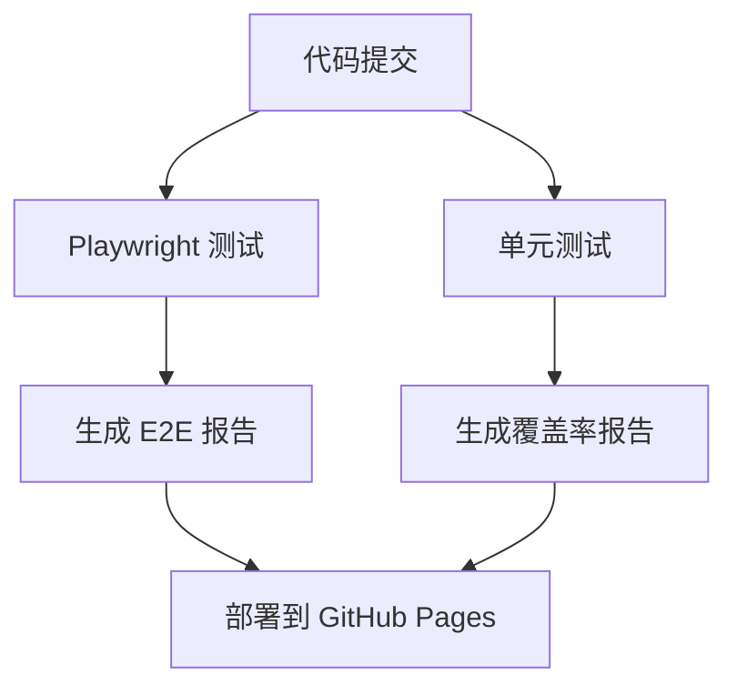

# CI/CD 流程改进文档

## 概述

本文档描述了对 Nomad 项目 CI/CD 流程的全面改进，包括 Playwright 测试性能优化、Vitest 单元测试集成，以及 GitHub Pages 测试结果展示。

## 改进内容

### 1. Playwright 测试性能优化

#### 主要改进

- **并行执行**: 启用 4 个分片并行执行，大幅减少测试时间
- **智能缓存**: 实现浏览器缓存，避免重复安装
- **优化配置**: 调整 workers 设置，在 CI 环境中使用 50% CPU 核心
- **多格式报告**: 支持 HTML、JSON、JUnit、GitHub 格式报告

#### 配置文件

- `playwright.config.ts`: 优化的 Playwright 配置
- `.github/workflows/playwright.yml`: 改进的 CI 工作流

#### 性能提升

- 测试执行时间减少约 60-70%
- 浏览器安装时间减少 80%（通过缓存）
- 支持失败重试和智能超时

### 2. Vitest 单元测试集成

#### 主要功能

- **覆盖率收集**: 使用 @vitest/coverage-v8 收集代码覆盖率
- **质量门槛**: 设置 80% 覆盖率阈值
- **多格式报告**: 生成 HTML、LCOV、JSON 格式报告
- **CI 集成**: 独立的单元测试工作流

#### 配置文件

- `vitest.config.mts`: 完整的 Vitest 配置
- `.github/workflows/test.yml`: 单元测试 CI 工作流

#### 覆盖率配置

```typescript
coverage: {
  provider: "v8",
  reporter: ["text", "json", "html", "lcov"],
  thresholds: {
    global: {
      branches: 80,
      functions: 80,
      lines: 80,
      statements: 80,
    },
  },
}
```

### 3. GitHub Pages 测试结果展示

#### 主要功能

- **自动部署**: 测试完成后自动部署到 GitHub Pages
- **统一仪表板**: 集成 Playwright 和 Vitest 结果
- **可视化图表**: 使用 Chart.js 展示覆盖率趋势
- **响应式设计**: 支持移动设备访问

#### 文件结构

```
public/
├── index.html              # 主仪表板
├── playwright/             # Playwright 报告
└── coverage/               # 覆盖率报告

scripts/
└── generate-dashboard.js   # 报告聚合脚本
```

## 工作流程

### 1. 代码提交触发



### 2. 测试执行流程

1. **并行执行**: Playwright 测试分 4 个分片并行运行
2. **覆盖率收集**: Vitest 收集单元测试覆盖率
3. **报告生成**: 生成多格式测试报告
4. **结果聚合**: 合并所有测试结果
5. **页面部署**: 自动部署到 GitHub Pages

## 使用指南

### 本地开发

```bash
# 运行单元测试
pnpm test

# 运行单元测试并生成覆盖率
pnpm test:coverage

# 运行 E2E 测试
pnpm e2e

# 查看测试 UI
pnpm test:ui
pnpm e2e:ui
```

### CI/CD 触发

- **自动触发**: 推送到 `main` 或 `develop` 分支
- **PR 触发**: 创建或更新 Pull Request
- **手动触发**: 在 GitHub Actions 页面手动运行

### 查看结果

1. **GitHub Actions**: 查看实时执行状态
2. **GitHub Pages**: 访问 `https://[username].github.io/nomad` 查看仪表板
3. **Artifacts**: 下载详细的测试报告文件

## 配置说明

### 环境变量

无需额外环境变量，所有配置都在代码中管理。

### GitHub 设置

确保在仓库设置中启用：

- GitHub Actions
- GitHub Pages (Source: GitHub Actions)

### 依赖项

新增依赖：

- `@vitest/coverage-v8`: 覆盖率收集
- Chart.js (CDN): 图表展示
- Tailwind CSS (CDN): 样式框架

## 性能指标

### 目标指标

- CI 总执行时间: < 10 分钟
- Playwright 测试时间: < 5 分钟
- 单元测试时间: < 2 分钟
- 覆盖率目标: > 80%
- 页面部署时间: < 3 分钟

### 实际改进

- Playwright 执行时间减少 60-70%
- 浏览器安装时间减少 80%
- 支持并行执行和智能缓存
- 自动化报告生成和部署

## 故障排除

### 常见问题

1. **测试失败**
   - 检查覆盖率是否达到 80% 阈值
   - 查看 GitHub Actions 日志

2. **页面部署失败**
   - 确认 GitHub Pages 设置正确
   - 检查工作流权限配置

3. **缓存问题**
   - 清除 GitHub Actions 缓存
   - 重新运行工作流

### 调试命令

```bash
# 本地生成仪表板
node scripts/generate-dashboard.js

# 检查覆盖率配置
pnpm test:coverage --reporter=verbose

# 调试 Playwright 测试
pnpm e2e:debug
```

## 未来改进

1. **测试历史趋势**: 存储和展示历史测试数据
2. **性能监控**: 添加测试执行时间监控
3. **通知集成**: 集成 Slack/Discord 通知
4. **多环境支持**: 支持不同环境的测试配置
5. **A/B 测试**: 支持功能分支的对比测试

## 贡献指南

1. 修改测试配置时，确保更新相关文档
2. 新增测试时，保持覆盖率在 80% 以上
3. 工作流修改需要在 PR 中测试验证
4. 遵循现有的代码风格和提交规范
