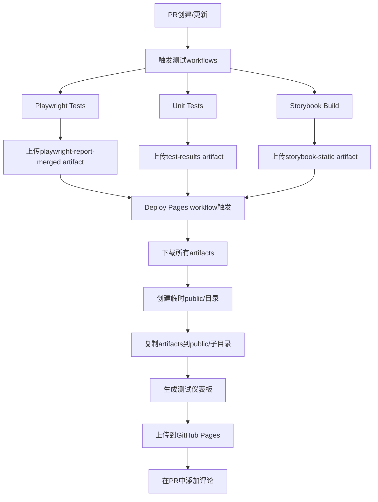

# GitHub Pages 部署问题排查和解决方案

## 问题总结

### 1. 子路径404错误

**症状：**

- ✅ 可以访问：`https://ukesjtu.github.io/nomad/`
- ❌ 无法访问：`https://ukesjtu.github.io/nomad/storybook/`
- ❌ 无法访问：`https://ukesjtu.github.io/nomad/playwright-report/`
- ❌ 无法访问：`https://ukesjtu.github.io/nomad/coverage/`

**根本原因：**
Artifact下载后的目录结构是嵌套的，导致文件没有被正确复制到部署目录。

**解决方案：**
修改 `.github/workflows/deploy-pages.yml` 中的文件复制逻辑，支持嵌套和扁平两种目录结构。

---

## 常见问题解答

### Q1: 生成的静态文件存储在哪里？

**A:** 静态文件**不在代码仓库中**，而是存储在两个地方：

1. **GitHub Actions Artifacts（临时）**
   - 位置：GitHub Actions运行记录中
   - 访问：`https://github.com/ukeSJTU/nomad/actions`
   - 保留时间：
     - Playwright & Unit Tests: 30天
     - Storybook: 7天

2. **GitHub Pages服务（最终部署）**
   - 位置：GitHub Pages专用存储
   - 访问：`https://ukesjtu.github.io/nomad/`
   - 不占用Git仓库空间

### Q2: 需要创建gh-pages分支吗？

**A:** **不需要！**

本项目使用的是**GitHub Actions原生部署方式**（`actions/deploy-pages@v4`），而不是传统的`gh-pages`分支方式。

**两种方式对比：**

| 特性       | 传统gh-pages分支 | GitHub Actions部署 |
| ---------- | ---------------- | ------------------ |
| 需要分支   | ✅ 需要          | ❌ 不需要          |
| 文件存储   | Git仓库          | GitHub Pages服务   |
| 仓库大小   | 会增大           | 不影响             |
| 部署方式   | 手动推送         | 自动化             |
| 配置复杂度 | 简单             | 需要workflow       |

### Q3: 代码仓库中的public/文件夹和部署的public/是同一个吗？

**A:** **不是！** 有两个完全不同的`public/`文件夹：

#### 1. 代码仓库的 `public/`

```
/Volumes/External/nomad/public/
├── file.svg
├── globe.svg
├── next.svg
├── requirement-breakdown.png
└── vercel.svg
```

- **用途：** Next.js应用的静态资源
- **生命周期：** 永久存在于Git仓库
- **访问方式：** 通过Next.js应用访问

#### 2. GitHub Actions临时 `public/`

```
(GitHub Actions Runner临时目录)/public/
├── index.html              # 测试仪表板
├── storybook/              # Storybook静态站点
├── playwright-report/      # E2E测试报告
└── coverage/               # 单元测试覆盖率
```

- **用途：** GitHub Pages部署内容
- **生命周期：** workflow运行时创建，结束后删除
- **访问方式：** 通过GitHub Pages访问

**它们完全独立，互不影响！**

---

## 部署流程详解

### 完整工作流程



### 关键步骤

1. **Artifact下载**

   ```yaml
   - name: Download Playwright report
     uses: dawidd6/action-download-artifact@v11
     with:
       run_id: ${{ github.event.workflow_run.id }}
       name: playwright-report-merged
       path: ./artifacts/
   ```

2. **文件组织**

   ```bash
   # 支持嵌套和扁平两种结构
   if [ -d "artifacts/storybook-static/storybook-static" ]; then
     cp -r artifacts/storybook-static/storybook-static/* public/storybook/
   elif [ -d "artifacts/storybook-static" ]; then
     cp -r artifacts/storybook-static/* public/storybook/
   fi
   ```

3. **生成仪表板**

   ```bash
   node scripts/generate-dashboard.js
   # 生成 public/index.html
   ```

4. **部署到GitHub Pages**

   ```yaml
   - name: Upload artifact
     uses: actions/upload-pages-artifact@v3
     with:
       path: "./public"

   - name: Deploy to GitHub Pages
     uses: actions/deploy-pages@v4
   ```

---

## 验证部署

### 使用验证脚本

```bash
./scripts/verify-gh-pages.sh
```

### 手动验证

访问以下URL确认部署成功：

- ✅ 主仪表板：`https://ukesjtu.github.io/nomad/`
- ✅ Storybook：`https://ukesjtu.github.io/nomad/storybook/`
- ✅ Playwright报告：`https://ukesjtu.github.io/nomad/playwright-report/`
- ✅ 覆盖率报告：`https://ukesjtu.github.io/nomad/coverage/`

### 检查GitHub Actions日志

1. 访问：`https://github.com/ukeSJTU/nomad/actions`
2. 找到最近的 "Deploy Test Reports & Storybook to GitHub Pages" workflow
3. 查看 "Extract and organize artifacts" 步骤的输出
4. 确认看到类似输出：
   ```
   === Artifact directory structure ===
   artifacts
   artifacts/playwright-report-merged
   artifacts/playwright-report-merged/playwright-report-merged
   ...
   Moving Playwright reports (nested structure)...
   Playwright reports organized
   ```

---

## 故障排查

### 问题：子目录仍然404

**检查清单：**

1. ✅ 确认workflow成功完成
2. ✅ 检查 "Extract and organize artifacts" 步骤的日志
3. ✅ 确认看到 "Moving ... (nested structure)" 或 "Moving ... (flat structure)"
4. ✅ 确认 `ls -la public/storybook/` 显示有文件
5. ✅ 等待1-2分钟让GitHub Pages更新缓存

### 问题：Artifacts未找到

**可能原因：**

- 前置workflow（Playwright/Unit Tests/Storybook）失败
- Artifact已过期（超过保留时间）
- Artifact名称不匹配

**解决方案：**

1. 检查前置workflow是否成功
2. 确认artifact名称一致：
   - `playwright-report-merged`
   - `test-results`
   - `storybook-static`

### 问题：Dashboard显示但数据为空

**可能原因：**

- `scripts/generate-dashboard.js` 无法读取报告数据
- 报告文件路径不正确

**解决方案：**
检查 `reports/` 目录是否有内容（虽然这个目录不会被部署，但用于生成dashboard）

---

## 最佳实践

### 1. 定期清理旧Artifacts

Artifacts会占用GitHub存储空间配额，建议：

- 保留最近30天的测试报告
- 保留最近7天的Storybook构建

### 2. 监控部署状态

在PR中查看自动评论，确认所有链接可访问。

### 3. 本地测试Dashboard生成

```bash
# 创建测试数据
mkdir -p reports/playwright reports/coverage

# 生成dashboard
node scripts/generate-dashboard.js

# 查看生成的文件
open public/index.html
```

---

## 相关资源

- [GitHub Pages文档](https://docs.github.com/en/pages)
- [GitHub Actions部署Pages](https://github.com/actions/deploy-pages)
- [dawidd6/action-download-artifact](https://github.com/dawidd6/action-download-artifact)
