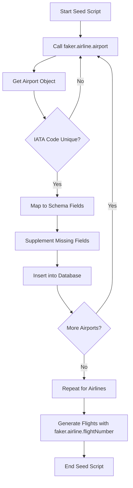

# Technical Design: Faker.js Airline Module Integration

## Context

The current seed script (`src/lib/db/seed.ts`) uses hardcoded JavaScript arrays for airports, airlines, and aircraft types. This approach was suitable for initial development but creates maintenance burden as the project matures.

Faker.js v8.0.0+ introduced a dedicated `airline` module with methods returning realistic aviation data. Since the project already uses `@faker-js/faker ^10.0.0`, this capability is immediately available without dependency changes.

**Stakeholders:**

- Developers (reduced maintenance, better test data)
- QA Engineers (more diverse test scenarios)
- Documentation (more realistic examples)

## Goals / Non-Goals

**Goals:**

- Replace hardcoded airport/airline/aircraft data with Faker.js Airline module
- Improve data realism for development and testing environments
- Reduce code maintenance burden (eliminate hardcoded arrays)
- Maintain backward compatibility (same data structure, same quantity)

**Non-Goals:**

- Production data generation (seed script is dev/test only)
- Schema changes or database migrations
- Real-time flight data integration
- Performance optimization (seed runs once per environment setup)

## Technical Decisions

### Decision 1: Use Faker.js Airline Module Over Custom Generators

**Options Considered:**

1. **Keep hardcoded arrays** (current approach)
   - ❌ High maintenance, limited diversity
2. **Build custom data generators**
   - ❌ Reinvents the wheel, high development cost
3. **Use external API for real flight data**
   - ❌ Requires API credentials, network dependency, rate limits
4. **Use Faker.js Airline module** ✅ **SELECTED**
   - ✅ Zero additional dependencies (already installed)
   - ✅ Industry-standard data patterns
   - ✅ Low maintenance (Faker.js team maintains data)
   - ✅ Rich API covering all aviation entities

**Rationale:** Faker.js Airline module provides the best balance of data quality, maintainability, and implementation simplicity.

### Decision 2: Generate Data at Seed Time (Not Runtime)

**Options Considered:**

1. **Use Faker in runtime API responses**
   - ❌ Unpredictable data, poor for production
2. **Generate seed data once and commit to repo**
   - ❌ Still hardcoded, defeats purpose of dynamic generation
3. **Generate at seed script execution** ✅ **SELECTED**
   - ✅ Fresh data per environment
   - ✅ Reproducible with seed control (`faker.seed()`)
   - ✅ Appropriate scope (dev/test only)

**Rationale:** Seed-time generation provides the flexibility needed for development while keeping data deterministic when needed (via `faker.seed()`).

### Decision 3: Maintain Current Seed Data Quantities

**Current quantities:**

- 12 airports
- 10 airlines
- 50 flights with 2-4 seat classes each
- 10 users with 1-5 passengers each

**Decision:** Keep these quantities unchanged.

**Rationale:**

- Avoids breaking existing tests that may depend on data volume
- Provides sufficient diversity for development
- Can be easily adjusted later if needed

## Implementation Details

### Faker.js Airline API Usage

The Faker.js `airline` module methods return **objects** (not strings):

```typescript
// Airport generation
const airport = faker.airline.airport();
// Returns: { name: "...", iataCode: "...", city: "..." }

// Access properties
airport.iataCode; // "JFK"
airport.name; // "John F. Kennedy International Airport"
airport.city; // "New York"

// Airline generation
const airline = faker.airline.airline();
// Returns: { name: "...", iataCode: "..." }

airline.iataCode; // "AA"
airline.name; // "American Airlines"

// Flight number generation
const flightNum = faker.airline.flightNumber();
// Returns: { airline: "AA", flightNumber: "1234" }
// Or use options: faker.airline.flightNumber({ addLeadingZeros: true })

// Aircraft type
const aircraft = faker.airline.airplane();
// Returns: { name: "Boeing 737", iataTypeCode: "73G" }

// Seat generation (bonus for future use)
const seat = faker.airline.seat();
// Returns: { seat: "12A" }
```

### Code Migration Pattern

**Before (hardcoded):**

```typescript
const airportData = [
  { iata_code: "JFK", name: "JFK International", city: "New York", ... },
  // ... 11 more hardcoded entries
];
```

**After (Faker.js):**

```typescript
const airportData = Array.from({ length: 12 }, () => {
  const airport = faker.airline.airport();
  return {
    iata_code: airport.iataCode,
    name: airport.name,
    city: airport.city,
    country: faker.location.country(), // Supplement missing fields
    timezone: faker.location.timeZone(),
  };
});
```

### Handling Missing Fields

Faker.js Airline module provides core aviation data, but our schema has additional fields:

| Schema Field | Faker.js Method    | Fallback/Supplement         |
| ------------ | ------------------ | --------------------------- |
| `iata_code`  | `airport.iataCode` | ✅ Direct                   |
| `name`       | `airport.name`     | ✅ Direct                   |
| `city`       | `airport.city`     | ✅ Direct                   |
| `country`    | N/A                | `faker.location.country()`  |
| `timezone`   | N/A                | `faker.location.timeZone()` |
| `logo_url`   | N/A                | Keep template string        |

**Decision:** Use `faker.location.*` methods to supplement missing geography data.

### Ensuring Unique Values

Airports and airlines must have unique IATA codes in the database:

```typescript
const usedIataCodes = new Set<string>();

const airportData = Array.from({ length: 12 }, () => {
  let airport;
  do {
    airport = faker.airline.airport();
  } while (usedIataCodes.has(airport.iataCode));

  usedIataCodes.add(airport.iataCode);
  return { iata_code: airport.iataCode, ... };
});
```

## Data Flow



## Risks / Trade-offs

### Risk 1: Non-Deterministic Data

**Risk:** Faker generates random data, which could break tests expecting specific values.

**Mitigation:**

- Seed script already generates random data (e.g., `faker.date.between()` for flight times)
- Tests should use factories or query data dynamically, not hardcode assumptions
- Can use `faker.seed(12345)` for deterministic output if needed

**Likelihood:** Low
**Impact:** Low

### Risk 2: Faker.js API Changes

**Risk:** Future Faker.js versions might change the `airline` module API.

**Mitigation:**

- Pin `@faker-js/faker` to major version (currently `^10.0.0` allows 10.x.x)
- Faker.js follows semantic versioning, breaking changes only in major versions
- Seed script is internal tooling, easy to update if needed

**Likelihood:** Low (across minor versions)
**Impact:** Low (isolated to one file)

### Risk 3: Performance Degradation

**Risk:** API calls to Faker might be slower than hardcoded arrays.

**Analysis:**

- Faker.js Airline module uses local data files, no network calls
- Modern systems generate 1000s of Faker records per second
- Seed script generates <100 records total

**Mitigation:** Not needed, performance impact negligible.

**Likelihood:** None
**Impact:** None

## Migration Plan

### Pre-Implementation Checklist

- ✅ Verify Faker.js version >= 8.0.0 (`package.json` shows `^10.0.0`)
- ✅ Review Faker.js Airline API documentation
- ✅ Confirm no tests hardcode specific seed data values

### Implementation Steps

1. **Phase 1-4 (Analysis, Design, Spec, Test Plan)**
   - Document current behavior
   - Write test plan for seed script validation

2. **Phase 5 (Implementation)**
   - Replace airport data generation logic
   - Replace airline data generation logic
   - Replace flight number generation logic
   - Replace aircraft type generation logic
   - Add uniqueness checks for IATA codes
   - Add inline comments documenting Faker.js usage

3. **Phase 6 (Testing)**
   - Run seed script: `pnpm db:seed`
   - Verify data in database: `pnpm db:studio`
   - Check data satisfies constraints (unique IATA codes, valid dates, etc.)
   - Run E2E tests to ensure app works with new seed data

### Rollback Plan

If issues arise:

1. Revert changes to `src/lib/db/seed.ts` (Git rollback)
2. Run original seed script
3. Investigate and fix issues
4. Re-apply changes

Rollback is trivial since:

- Only one file affected
- No schema changes
- No production impact

## Open Questions

- **Q:** Should we make seed data deterministic by using `faker.seed()`?
  - **A:** Not initially - randomness is valuable for discovering edge cases. Can add later if tests require determinism.

- **Q:** Should we increase the number of airports/airlines now that generation is easier?
  - **A:** No, keep quantities unchanged to avoid breaking existing assumptions. Can adjust in future if needed.

- **Q:** Should we use `faker.airline.recordLocator()` for booking/order IDs?
  - **A:** Out of scope for this change. Can be added in future when seeding orders/bookings.
