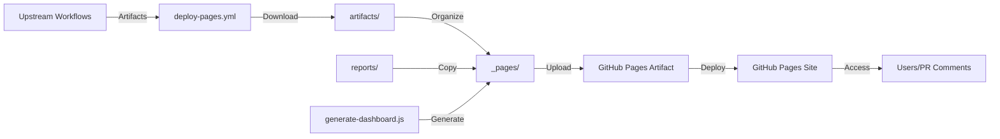

# Design: Separate Pages Output Directory

## Overview

This design document outlines the technical approach for separating CI/CD GitHub Pages output from the Next.js project's static assets directory.

## Architecture Context

### Current State

```
nomad/
├── public/                           # Next.js static assets (SVG icons, images)
│   ├── file.svg
│   ├── globe.svg
│   └── ...
├── .github/workflows/
│   └── deploy-pages.yml             # Writes to public/ directory
├── scripts/
│   └── generate-dashboard.js        # Writes to public/ directory
└── reports/                          # Intermediate test artifacts
    ├── playwright/
    └── coverage/
```

**Problem**: The `public/` directory serves dual purposes:

1. Next.js static assets (committed to git)
2. CI/CD test report outputs (should not be committed)

### Target State

```
nomad/
├── public/                           # Next.js static assets ONLY
│   ├── file.svg
│   ├── globe.svg
│   └── ...
├── _pages/                           # CI/CD GitHub Pages output (gitignored)
│   ├── index.html                   # Generated dashboard
│   ├── playwright-report/           # E2E test reports
│   ├── coverage/                    # Unit test coverage
│   └── storybook/                   # Component library
├── .github/workflows/
│   └── deploy-pages.yml             # Writes to _pages/ directory
├── scripts/
│   └── generate-dashboard.js        # Writes to _pages/ directory
├── reports/                          # Intermediate test artifacts
│   ├── playwright/
│   └── coverage/
└── .gitignore                        # Ignores _pages/
```

## Design Decisions

### Decision 1: Directory Name Choice

**Options Considered**:

1. `_pages/` (chosen)
2. `gh-pages/`
3. `dist/pages/`
4. `.pages/`

**Rationale for `_pages/`**:

- **Underscore prefix convention**: Follows Next.js naming pattern (`_next/` for build outputs)
- **Semantic clarity**: Clearly indicates GitHub Pages content
- **Framework compatibility**: Next.js ignores underscore-prefixed directories
- **Visible in file explorers**: Unlike dot-prefixed directories (`.pages/`)
- **No naming collision**: Avoids confusion with `gh-pages` branch concept

### Decision 2: Scope of Changes

**Affected Files**:

1. `.github/workflows/deploy-pages.yml` - Workflow configuration
2. `scripts/generate-dashboard.js` - Dashboard generation
3. `.gitignore` - Version control exclusion

**Not Affected**:

- Next.js configuration (no changes needed)
- Other workflows (they don't reference these paths)
- Deployment URLs (GitHub Pages serves artifact content as root)

### Decision 3: Backward Compatibility

**Approach**: Complete migration without backward compatibility layer

**Rationale**:

- CI/CD artifacts are ephemeral (generated per run)
- No persistent state to migrate
- Clean cut-over is simpler than maintaining dual paths
- Rollback is trivial (just path changes)

## Implementation Details

### 1. Workflow Changes (deploy-pages.yml)

**Location**: Line 78-102 (Extract and organize artifacts step)

**Changes**:

```yaml
# BEFORE
mkdir -p public/playwright-report public/coverage public/storybook
cp -r artifacts/playwright-report-merged/* public/playwright-report/
cp -r artifacts/test-results/* public/coverage/
cp -r artifacts/storybook-static/* public/storybook/
ls -la public/

# AFTER
mkdir -p _pages/playwright-report _pages/coverage _pages/storybook
cp -r artifacts/playwright-report-merged/* _pages/playwright-report/
cp -r artifacts/test-results/* _pages/coverage/
cp -r artifacts/storybook-static/* _pages/storybook/
ls -la _pages/
```

**Location**: Line 112 (Upload artifact step)

**Changes**:

```yaml
# BEFORE
- name: Upload artifact
  uses: actions/upload-pages-artifact@v3
  with:
    path: "./public"

# AFTER
- name: Upload artifact
  uses: actions/upload-pages-artifact@v3
  with:
    path: "./_pages"
```

### 2. Script Changes (generate-dashboard.js)

**Function**: `main()` (lines 318-336)

**Changes**:

```javascript
// BEFORE
console.log("Generating test dashboard...");
ensureDir("public");
copyDir("reports/playwright", "public/playwright");
copyDir("reports/coverage", "public/coverage");
const dashboardHtml = generateDashboard(playwrightData, coverageData);
fs.writeFileSync("public/index.html", dashboardHtml);
console.log("Dashboard generated successfully!");

// AFTER
console.log("Generating test dashboard...");
ensureDir("_pages");
copyDir("reports/playwright", "_pages/playwright");
copyDir("reports/coverage", "_pages/coverage");
const dashboardHtml = generateDashboard(playwrightData, coverageData);
fs.writeFileSync("_pages/index.html", dashboardHtml);
console.log("Dashboard generated successfully!");
```

### 3. Git Configuration (.gitignore)

**Addition**:

```gitignore
# CI/CD GitHub Pages artifacts (generated by deploy-pages.yml)
_pages/
```

**Note**: Ensure `public/` is NOT in `.gitignore` as it contains committed Next.js static assets.

## Data Flow Diagram



## File Path Mapping

| Old Path                    | New Path                    | Purpose            |
| --------------------------- | --------------------------- | ------------------ |
| `public/index.html`         | `_pages/index.html`         | Dashboard homepage |
| `public/playwright-report/` | `_pages/playwright-report/` | E2E test results   |
| `public/coverage/`          | `_pages/coverage/`          | Unit test coverage |
| `public/storybook/`         | `_pages/storybook/`         | Component library  |

**Deployed URLs** (unchanged):

- Dashboard: `https://<org>.github.io/<repo>/`
- Storybook: `https://<org>.github.io/<repo>/storybook/`
- Playwright: `https://<org>.github.io/<repo>/playwright-report/`
- Coverage: `https://<org>.github.io/<repo>/coverage/`

## Testing Strategy

### Unit Testing

- **Script execution**: Run `generate-dashboard.js` with mock data
- **Verify**: Files created in `_pages/` directory
- **Check**: No files created in `public/`

### Integration Testing

- **Workflow execution**: Trigger workflow on test branch
- **Verify**: Workflow completes without errors
- **Check**: `_pages/` artifact uploaded successfully

### End-to-End Testing

- **Deployment**: Verify GitHub Pages deployment succeeds
- **Access**: Visit all deployed report URLs
- **Validate**: No 404 errors, all links functional
- **PR Comments**: Verify URLs in PR comments are correct

## Risk Analysis

### Low Risks

- **Path typos**: Mitigated by code review and testing
- **Missing path updates**: Mitigated by comprehensive grep search

### Negligible Risks

- **Deployment failure**: Rollback is immediate (revert commit)
- **URL breakage**: URLs are relative, unaffected by source path changes

### No Risk

- **Next.js build**: Unaffected (doesn't process `_pages/`)
- **User impact**: End users see no changes
- **Data loss**: CI/CD artifacts are regenerated each run

## Rollback Strategy

**Immediate Rollback** (if deployment fails):

1. Revert commit: `git revert HEAD`
2. Push to trigger new workflow run
3. **Timeframe**: < 5 minutes

**Manual Rollback** (if needed):

1. Edit workflow file: `_pages/` → `public/`
2. Edit script: `_pages/` → `public/`
3. Commit and push
4. **Timeframe**: < 10 minutes

## Monitoring & Validation

**Success Indicators**:

- ✅ Workflow runs complete successfully
- ✅ GitHub Pages deployment succeeds
- ✅ All report URLs return 200 status
- ✅ PR comments contain working links
- ✅ `git status` doesn't show `_pages/` changes

**Failure Indicators**:

- ❌ Workflow fails at "Upload artifact" step
- ❌ GitHub Pages deployment shows 404
- ❌ PR comment URLs are broken
- ❌ `_pages/` directory appears in git status

## Future Considerations

### Potential Enhancements

1. **Directory cleanup**: Add workflow step to clean old `_pages/` before generation
2. **Artifact retention**: Configure GitHub Actions artifact retention policy
3. **Local development**: Add npm script to serve `_pages/` locally for testing

### Maintenance

- No ongoing maintenance required
- Path is self-documenting through naming convention
- `.gitignore` entry prevents accidental commits

## Related Patterns

This design follows the **Separation of Concerns** principle:

- **`public/`**: Project static assets (source code concern)
- **`_pages/`**: CI/CD artifacts (build process concern)
- **`reports/`**: Intermediate build artifacts (temporary concern)

Similar patterns in the ecosystem:

- Next.js: `_next/` for build outputs
- Jekyll: `_site/` for generated site
- Hugo: `_public/` for build artifacts
